# Blockopoly - parte 1

Por: [Solange Gueiros](https://www.linkedin.com/in/solangegueiros/)

Este é uma divertida variação de um famoso jogo de tabuleiro em que propriedades como bairros, casas, hotéis ou empresas são compradas e vendidas, em que uns jogadores ficam "ricos" e outros vão à falência. No Brasil é conhecido como 'Banco imobiliário', ou 'Monopoly' no mundo. A ideia principal do jogo mapeia muito bem os sistemas Blockchain e vamos construir partes do jogo para demonstrar isto.

As propriedades do jogo `Blockopoly` são os espaços `Reactors` espalhados pelo mundo:
 


Nestes espaços profissionais da área se encontram, aprendem e se conectam - tanto aos colegas locais quanto às idéias e tecnologias líderes da indústria na Microsoft, parceiros e comunidades de código aberto.

Nesta parte apresentaremos a arquitetura do jogo e criamos o primeiro smart contract: `Bank`, que controla o dinheiro, os saldos de cada um, a emissão e as transferências entre contas. 

# Pré-requisitos

1. Node.js e NPM (Node Package Manager)
2. Visual Studio Code (VSCode)
3. Truffle

## Node.js e NPM

Uma das dependências é NPM, que é instalado com Node.js.

Pra verificar se Node.js e NPM já estão instalados, utilize os comandos abaixo no terminal:

```shell
node --version
npm --version
```


Se não estiverem instalados, erros serão apresentados. 
Vá em [Node.js](https://nodejs.org/en/) caso precise instalá-los.

Caso queira ter mais de uma versão do node instalada, utilize o gerenciador de versões para o node, chamado [nvm](https://github.com/nvm-sh/nvm).

## Editor para código-fonte

Precisamos de algum editor de código, de preferência um que destaque as linguagens Solidity e Javascript.

[VS Code](https://code.visualstudio.com/) é uma boa escolha.

Para instalar, [faça o download](https://code.visualstudio.com/download).

Após a instalação do VS code, verifique se está ok consultando sua versão no terminal:

```shell
code -v
```


## Truffle

[Truffle](https://www.trufflesuite.com/truffle) é um conhecido framework para desenvolvimento de smart contracts, que facilita a vida do desenvolvedor.
Entre suas características, podemos citar o gerenciamento da "vida" de um smart contract (você pode fazer várias publicações e saber qual foi a última), desenvolvimento de scripts para deploy, testes automatizados e gerenciamento de rede simplificado.

Da mesma forma também facilita o desenvolvedor RSK porque podemos configurar as redes RSK no Truffle.

Para instalar Truffle, no terminal, digite o comando abaixo no terminal e pressione a tecla `enter`:

```shell
npm install -g truffle
```


Quando a instalação finalizar, feche a janela do terminal e abra novamente para verificar a versão do Truffle:

```shell
truffle version
```


# Inicialize um projeto Truffle 

Crie um novo diretório, por exemplo `blockopoly`, e navegue até ele no terminal.

```shell
mkdir blockopoly
cd blockopoly
```

Por exemplo, eu vou criar em `C:\ETH\` (Estou utilizando Windows).

Meu projeto estará localizado no diretório `C:\ETH\blockopoly`.

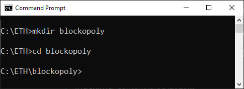

Na pasta blockopoly, inicialize um projeto Truffle:

```shell
truffle init
```

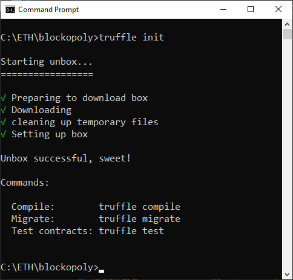

Abra a pasta no VSCode. 

```shell
code .
```

Você verá uma estrutura de diretórios como esta:

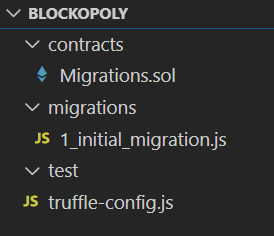

* `./contracts`: Todos os smart contracts serão salvos nesta pasta.
* `./migrations`: Os scripts para publicação ficarão armazenados aqui.
* `./test`: Aqui serão salvos os scripts para testes.
* `./truffle-config.js`: Este é o arquivo de configuração do Truffle. Aqui vamos configurar as redes, incluindo RSK.

Veja que os seguintes arquivos também foram criados:

* `Migrations.sol`: Smart contract que registra todos as publicações realizadas em uma rede.
* `1_initial_migration.js`: Publicação do `Migrations.sol`.


### Inicialize um projeto npm

Quando inicializamos um projeto Truffle a partir do template, também precisamos inicializar um projeto npm.

Podemos fazer isto diretamente no terminal do VS Code. Vá no menu `Terminal` e selecione `New Terminal`.

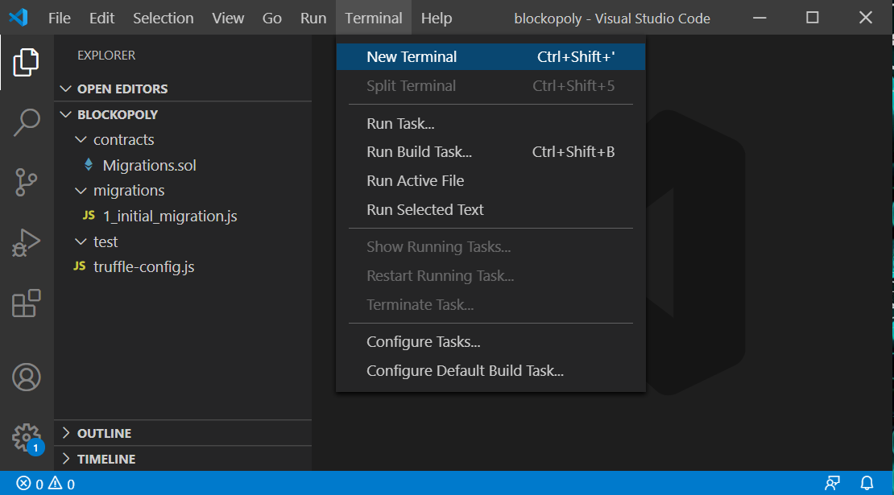

Para inicializar um projeto npm na pasta `blockopoly`,  execute o comando abaixo no terminal:

```shell
npm init -y
```

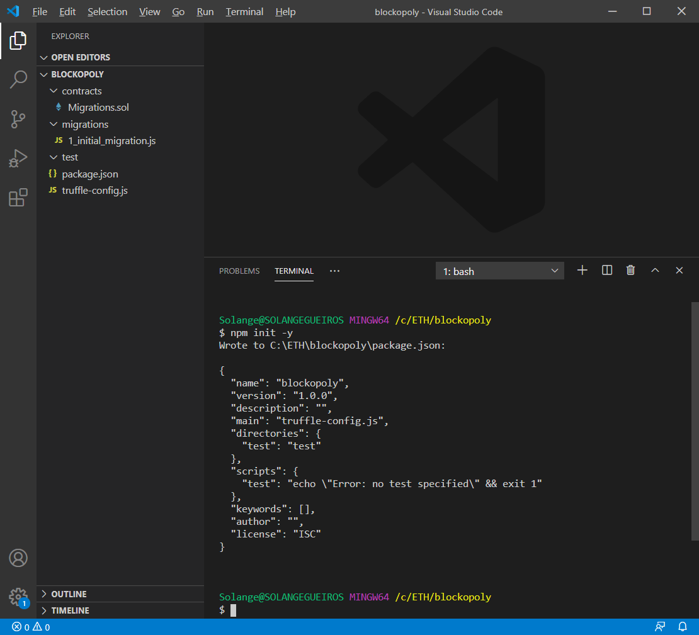

Este comando cria um arquivo de configurações chamado `package.json`.

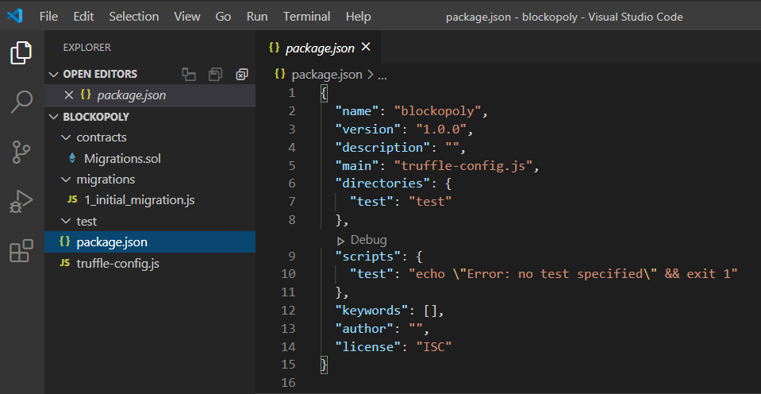

## Truffle development console

Truffle possui um console interativo que inclui um blockchain de desenvolvimento. Isso é muito útil para compilar, publicar e testar localmente.

Execute o console de desenvolvimento digitando o seguinte comando no terminal do VS Code:

```shell
truffle develop
```

O comando foi executado com sucesso se você visualizar uma lista de 10 contas / endereços, uma lista com as 10 chaves privadas correspondentes, um mnemônico e o prompt de comando mudar para `truffle(develop)>`

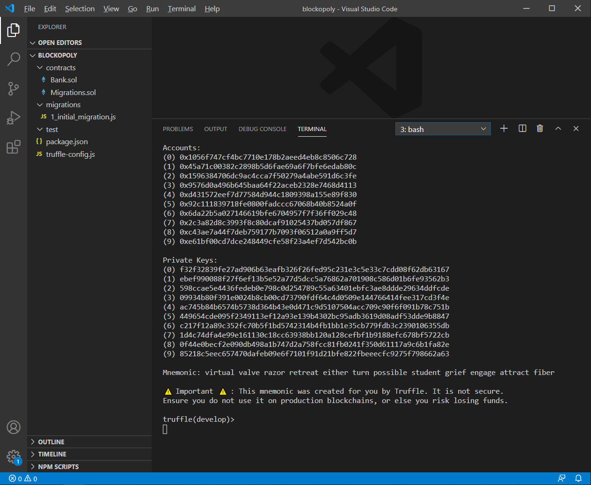

> Os comando Truffle podem ser executados dentro ou fora do console de desenvolvimento.
> 
> Se estamos no console de desenvolvimento Truffle, não precisamos iniciar os comandos com `truffle`. 
> 
> Por exemplo, se fora do console utilizamos `truffle test`, dentro do console usamos apenas `test`.

Quando quiser sair do Truffle console, digite:

```shell
.exit
```

# O jogo

Nosso jogo é composto por 3 smart contracts: 

* Bank
* AssetManager
* Blockopoly

## Bank

O banco é a entidade que controla o dinheiro, tanto a emissão dele quanto as transferências e os saldos de cada um. 

## Asset Manager

É um gerenciador de ativos, no nosso caso é o administrador das propriedades que serão negociadas. 

## Blockopoly

Este é o smart contract principal do jogo. Através dele são definidos jogadores, propriedades negociadas, início, final do jogo e o ganhador.

Então vamos lá! 

Chegou o momento de criar e interagir com cada um deles.

# Bank

Neste smart contract estarão as regras da entidade que controla o dinheiro, tanto a emissão dele quanto as transferências, além dos saldos de cada um. 

## Crie o smart contract Bank

Na pasta `contracts`, crie um novo arquivo chamado `Bank.sol`.

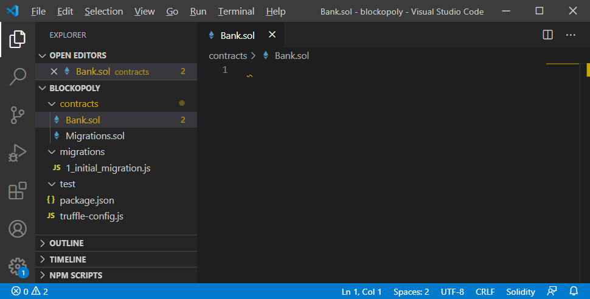

Copie o código fonte:

```javascript
pragma solidity >=0.5.0 <0.7.0;

contract Bank {
    // The keyword "public" makes variables
    // accessible from other contracts
    address public minter;
    mapping (address => uint) private balances;

    // Events allow clients to react to specific
    // contract changes you declare
    event Sent(address from, address to, uint amount);

    // Constructor code is only run when the contract
    // is created
    constructor() public {
        minter = msg.sender;
    }

    // Sends an amount of newly created coins to an address
    // Can only be called by the contract creator
    function mint(address receiver, uint amount) public {
        require(msg.sender == minter, "Sender is not minter");
        require((amount < 1e60), "Amount isn't too big");

        balances[receiver] += amount;
    }

    // Sends an amount of existing coins
    // from any caller to an address
    function sendMoney(address receiver, address sender, uint amount) public {
        require(msg.sender == minter, "Only the banker can authorize transfers");
        require(amount <= balances[sender], "Insufficient balance.");
        balances[sender] -= amount;
        balances[receiver] += amount;
        emit Sent(sender, receiver, amount);
    }

    function getBalance(address account) public view returns (uint) {
        require(msg.sender == account || msg.sender == minter,
           "You cannot get a balance on someone else's account");
        return balances[account];
    }
}
```

E cole aqui:

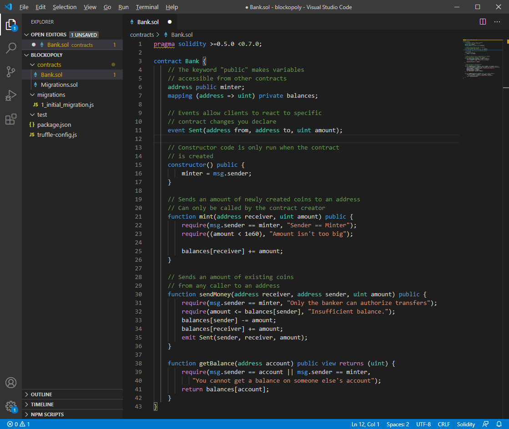

Salve o arquivo.

## Bank.sol

Este smart contract contém:

### Variáveis

* Uma variável pública `minter` para saber quem é o banqueiro, o emissor de dinheiro.
* Um mapping (variável do tipo chave -> valor) chamada `balances`, privada, que armazena o saldo de cada endereço.

### Eventos

* Um evento `Sent` que avisa cada vez que alguém envia dinheiro para outra pessoa.

### Construtor

O `constructor` (construtor), executado apenas no momento da criação do banco, define quem é o `minter`.

### Funções

* Uma função `mint` que faz a emissão de dinheiro.
* Uma função `sendMoney` para enviar dinheiro de um endereço para outro.
* Uma função `getBalance` que retorna o saldo de um determinado endereço.

## Compile o smart contract

No `Truffle development console`, digite:

```shell
compile
```

Veja o resultado com a mensagem `Compiled successfully`:

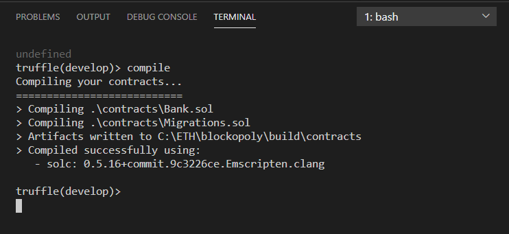

## Publique o smart contract

Primeiro precisamos criar um novo arquivo com instruções para publicação. 
Ao encontrá-lo, Truffle vai processá-lo no momento do deploy.

### Crie o arquivo 2_deploy_contracts.js

O diretório `migrations` contém arquivos JavaScript para a publicação dos contratos na rede. 
Estes arquivos são responsáveis por preparar suas tarefas de publicação e são escritos pensado que sua publicação pode ser alterada com o tempo.
O histórico das migrações executadas anteriormente é gravado no Blockchain a partir do smart contract Migrations. Fonte: [truffle: running-migrations](https://www.trufflesuite.com/docs/truffle/getting-started/running-migrations)

Usualmente começamos o nome do arquivo com um número, dado que o Truffle faz o deploy dos arquivos em ordem alfabética e desta forma definimos a ordem de publicação dos smart contracts.

Na pasta `migrations`, crie o arquivo `2_deploy_contracts.js`

Copie e cole:

```javascript
var Bank = artifacts.require("Bank");

module.exports = function(deployer) {
  deployer.deploy(Bank);
};
```

Ficará desta forma: 

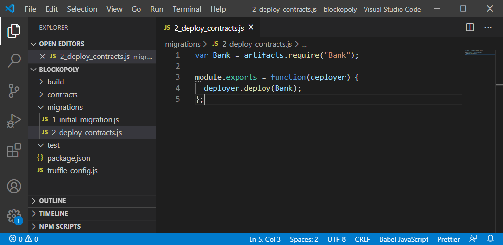

### Migrate

No `Truffle development console`, execute este comando:

```shell
migrate
```

Como este é um simulador, rapidamente as transações da publicação do smart contract são gravadas no Blockchain, não há necessidade de esperar para validação e inclusão da transação em um bloco.

Se for necessário, o comando `migrate` vai compilar os smart contracts novamente.

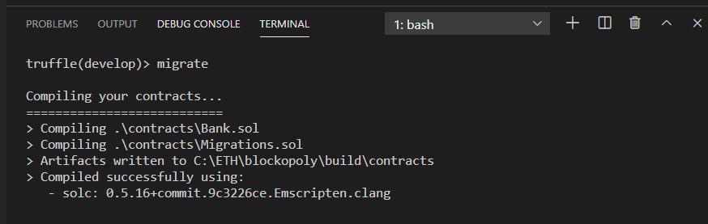

Primeiro é executada a publicação do smart contract `Migrations.sol`, que foi gerado pelo Truffle:

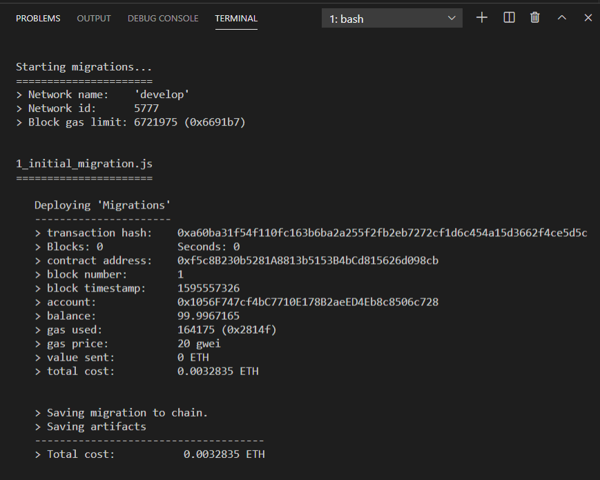

E depois faz publicação do nosso smart contract `Bank.sol`:


# Interagindo com o smart contract

Vamos interagir com nosso `Bank` através do Truffle console.

## Suas contas / endereços

No Truffle console:

```javascript
const accounts = await web3.eth.getAccounts()
```

Para listar todas as contas depois:

```javascript
accounts
```

Para olhar uma conta, por exemplo, a primeira da lista, `accounts[0]`:

```javascript
accounts[0]
```

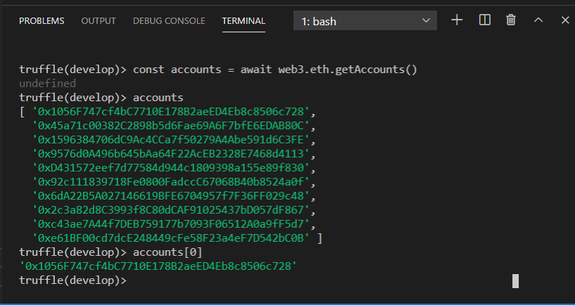

## Faça a conexão com seu Bank

Vamos atribuir a variável `bank` a instância do smart contract `Bank` já publicado:

```javascript
const bank = await Bank.deployed()
```

Verifique se a instância está OK.

Escreva o nome da variável:  `bank`, tecle `.` e depois aperte a tecla TAB duas vezes para acionar o recurso autocompletar. 
Será apresentado o endereço e hash da transação na publicação, além de outras coisas, incluindo todas as váriaveis e métodos públicos disponíveis. 

```javascript
bank. [TAB] [TAB]
```

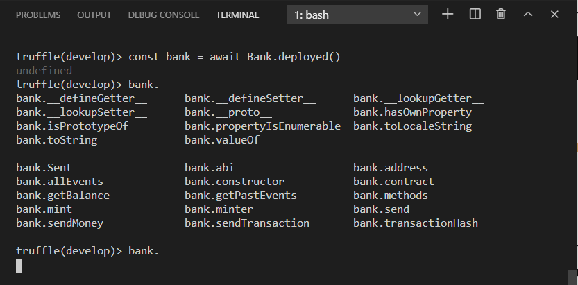

## Emissor

No Truffle console:

```javascript
bank.minter()
```

Perceba que o emissor é a conta que fez a publicação do smart contract. 
Dado que nenhuma conta foi especificada no arquivo `2_deploy_contracts.js`, é utilizada como default a primeira conta da lista, que é a `accounts[0]`

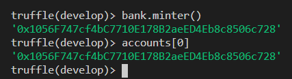

## Saldos

Para consultar o saldo de uma conta, utilize a função `getBalance` passando como parâmetro a conta a ser consultada:

Por exemplo, vou consultar o saldo da `accounts[0]`, que é `0x1056F747cf4bC7710E178B2aeED4Eb8c8506c728`: 

```javascript
(await bank.getBalance(accounts[0])).toString()
```

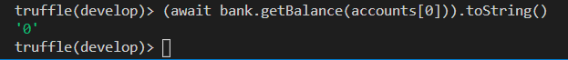

O saldo é zero! Então vamos ao próximo passo para emitir moedas.

## Emissão de moedas

Apenas a conta do emissor (minter) pode emitir moedas. 
Emitirei 1000 moedas para ela mesma.

Passe como parâmetros a conta que receberá as moedas, e a quantidade:

```javascript
bank.mint(accounts[0], 1000, {from: accounts[0]})
```

> Perceba que existe um parâmetro a mais do que o especificado na definição da função. São as informações de quem está enviando a transação, que, no nosso caso, também é `accounts[0]`, dado que ela é a conta emissora.

Foi enviada uma transação para a emissão de 100,00 tokens para a conta 0.

Você pode acompanhar os detalhes da transação no terminal: 

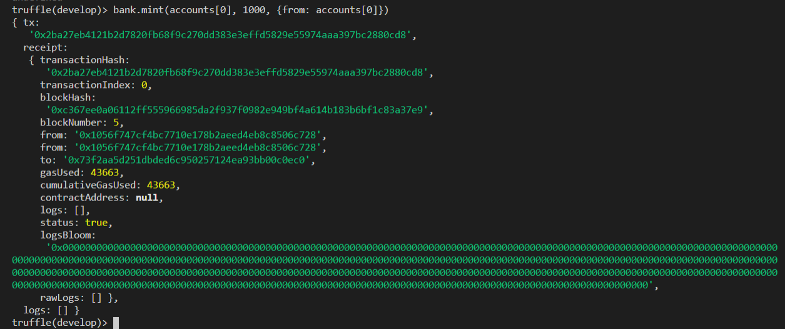

### Verifique o saldo novamente

Após a emissão de moedas, vou consultar novamente o saldo da `accounts[0]`, 
mas agora vamos especificar o endereço, ao invés de usar a posição na lista: 

```javascript
(await bank.getBalance("0x1056F747cf4bC7710E178B2aeED4Eb8c8506c728")).toString()
```

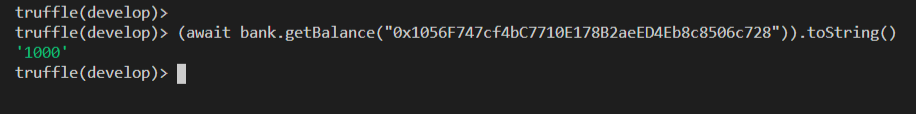

Que maravilha! Agora temos 1000 moedas.

> Somente o dono do banco ou a própria conta consegue consultar seu saldo!

## Envie dinheiro

A conta `accounts[0]` vai enviar 300 moedas para a segunda conta da lista, `accounts[1]`: 

`0x45a71c00382C2898b5d6Fae69A6F7bfE6EDAB80C`

Apenas o banqueiro tem autorização para enviar dinheiro de uma conta para outra.

```javascript
let transaction = await bank.sendMoney(accounts[1], accounts[0], 300, {from: accounts[0]})
```

Guardamos os detalhes da transação na variável `transaction`.

Veja os detalhes:

```javascript
transaction
```

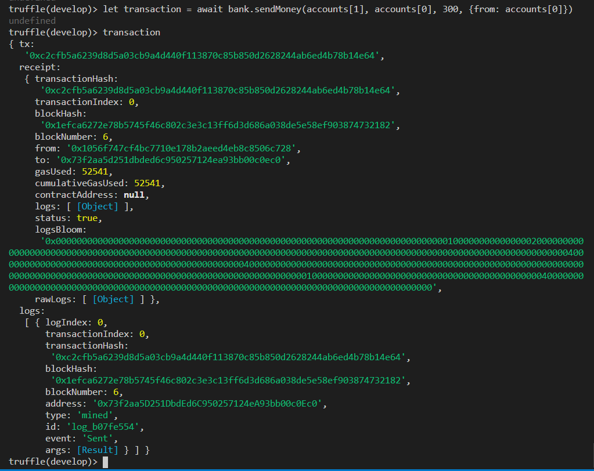

## Evento *Sent*

Veja a parte de logs da transação `sendMoney`. Você encontrará o evento `Sent`, com os detalhes da transferência de moedas:

* '0': From - quem enviou
* '1': To - destinatário
* '2': Amount - quantidade

```javascript
transaction.logs
```

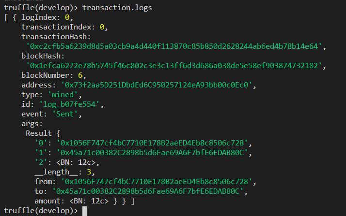

Amount está representado como BN, que é o tipo BigNumber. '12c' é o número hexadecimal, que corresponde a 300.

## Saldos após a transferência

Consulte os saldos das contas novamente.

```javascript
(await bank.getBalance(accounts[0])).toString()

(await bank.getBalance(accounts[1])).toString()
```

A conta `accounts[1]` agora tem 300 moedas.

O valor foi subtraído no saldo da conta `accounts[0]`, que tem 700 moedas neste momento.

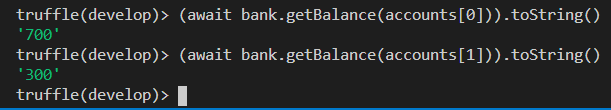

# Próximos passos

Nesta parte do tutorial do jogo `Blockopoly` foi ensinado como criar o smart contract `Bank`, utilizando a linguagem Solidity. Ele controla o dinheiro, os saldos de cada um, a emissão e as transferências entre contas.  

Lembre-se que nosso jogo é composto de 3 smart contracts: 

* Bank
* AssetManager
* Blockopoly

Na próxima parte do tutorial continuaremos com o gerenciador de ativos, o smart contract `AssetManager`, que é o administrador das propriedades que serão negociadas. 

Continue em [Blockopoly - parte 2](../Tutorial_part02/README.md).
