# Blockopoly - parte 3

Por: [Solange Gueiros](https://solange.dev/)

Na [parte 1](../Tutorial_part01/README.md) apresentamos a arquitetura do jogo e criamos o primeiro smart contract: `Bank`, que controla o dinheiro: saldos de cada um, emissão e transferências entre contas.

Na [parte 2](../Tutorial_part02/README.md) criamos o smart contract `AssetManager`, nosso gerenciador de ativos, que é o administrador das propriedades negociadas. 

Nosso jogo é composto por 3 smart contracts: 
- Bank
- AssetManager
- Blockopoly

Nesta terceira e última parte construiremos o smart contract `Blockopoly` e demonstraremos o funcionamento de uma partida.

# Blockopoly

O `Blockopoly` é smart contract principal do jogo. Através dele são definidos os jogadores, as propriedades negociadas, o início e final do jogo.


Imagem: [Ylanite Koppens - Pexels](https://www.pexels.com/pt-br/foto/abstrato-banco-imobiliario-borrao-brincadeiras-776654/)

Escolha quem vai ser o banqueiro. 
Esse jogador é responsável por todo o dinheiro e pelas propriedades que ainda pertencem ao banco. 
O banqueiro vai publicar o smart contract `Blockopoly`.

## Crie o smart contract Blockopoly

Abra o projeto `blockopoly` no VS Code. Na pasta `contracts`, crie um novo arquivo chamado `Blockopoly.sol`.

Copie e cole o código fonte:

```javascript
pragma solidity >=0.5.0 <0.7.0;
 
import "./Bank.sol";
import "./AssetManager.sol";
 
contract Blockopoly {
    address public banker;
    Bank public bank;
    AssetManager public assetManager;

    struct  Player {
        address addr;
        string name;
    }
    Player[] public players;
    mapping(string => bool) public names;
    mapping(address => Player) public addrPlayerMapping;

    bool public started;
    uint256 private endTime;
 
    event GameStarted();
    event PlayerJoined(address player, string name);

    constructor() public {
        banker = msg.sender;
        bank = new Bank();
        bank.mint(banker, 100000);
        
        assetManager = new AssetManager();
        publishProperties();
    }
 
    function publishProperties() private {
        assetManager.addAsset("Redmond Reactor", 100, banker);
        assetManager.addAsset("Seattle Reactor", 100, banker);
        assetManager.addAsset("San Francisco Reactor", 100, banker);
        assetManager.addAsset("New York Reactor", 100, banker);
        assetManager.addAsset("Toronto Reactor", 100, banker);
        assetManager.addAsset("London Reactor", 100, banker);
        assetManager.addAsset("Sao Paulo Reactor", 100, banker);
        assetManager.addAsset("Tel Aviv Reactor", 100, banker);
        assetManager.addAsset("Stockholm Reactor", 100, banker);
        assetManager.addAsset("Abu Dhabi Reactor", 100, banker);
        assetManager.addAsset("Sydney Reactor", 100, banker);
        assetManager.addAsset("Shanghai Reactor", 100, banker);
        assetManager.addAsset("Bangalore Reactor", 100, banker);
    }
 
    function startGame() public {
        require(msg.sender == banker, "Only the Banker can start the game");
        require(!started, "Game already started");
 
        uint length = players.length;
        require(length >= 2, "Need at least two players");
 
        for(uint i = 0; i < length; i++) {
            Player memory p = players[i];
            bank.mint(p.addr, 1000);
        }
 
        started = true;
        endTime = now + 15 minutes;
        emit GameStarted();
    }

    function joinGame(string memory _name) public {
        require(players.length < 6, "Game is full");
        require(!names[_name], "Name is already taken");
 
        Player memory p = Player({
            addr: msg.sender,
            name: _name
          }
        );
        players.push(p);
        names[_name] = true;
        addrPlayerMapping[msg.sender] = p;
 
        emit PlayerJoined(msg.sender, _name);
    }
 
    function buyProperty(string memory _name) public {
        require(started, "Game not started");
        require(now <= endTime, "Game over");

        address owner = assetManager.getOwner(_name);
        uint price = 100;
 
        require(owner != msg.sender, "Player can't already own the property");
        require(bank.getBalance(msg.sender) >= price, "Insuficcient funds");
 
        bank.sendMoney(owner, msg.sender, price);
        assetManager.transferAsset(owner, msg.sender, _name);
    }
    
    function getWinner() public view returns (string memory winner) {
        require(started, "Game not started");
        require(now > endTime, "Game not ended");

        uint winnerIndex;
        uint greaterBalance = 0;
        uint auxBalance = 0;
        
        for (uint i = 0; i <  players.length; i++) {
            auxBalance = bank.getBalance(players[i].addr);
            if (auxBalance > greaterBalance) {
                winnerIndex = i;
                greaterBalance = auxBalance;
            }
        }
        return players[winnerIndex].name;
    }    
}
```

E cole no arquivo `Blockopoly.sol`.

Ficará desta forma: 

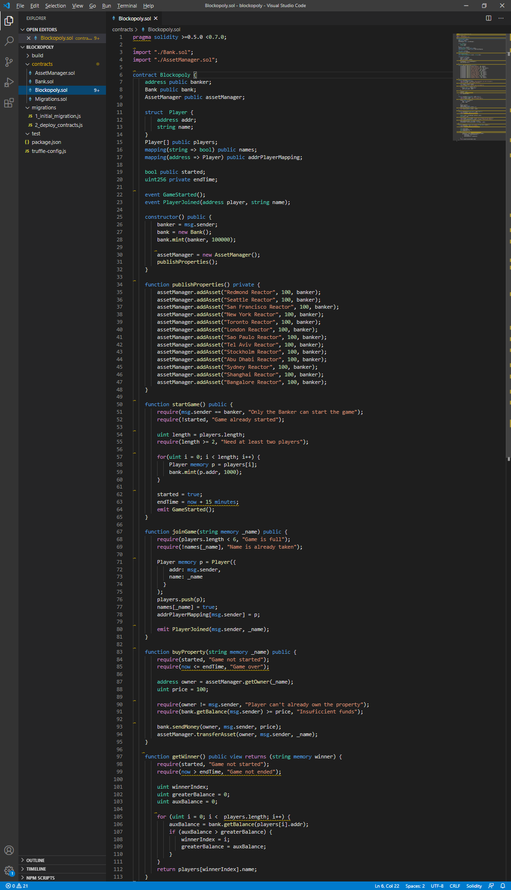

## Blockopoly.sol

Blockopoly.sol importa os outros smart contracts criados anteriormente:

```javascript
import "./Bank.sol";
import "./AssetManager.sol";
```

Este smart contract é o mais complexo de todos, entenda cada parte:

### Variáveis

* Uma variável pública `banker` que define quem é o banqueiro do jogo;
* Uma variável pública `bank`, que é o smart contract banco, importado;
* Uma variável pública `assetManager`, que é o smart contract gerenciador de ativos, também importado;
* Uma estrutura chamada `Player`, que armazena todas as informações de um jogador: endereço (account) e nome;
* Um array `players` que é  a lista pública de jogadores;
* Um mapping chamado `names`, público, que controla se um nome já está sendo utilizado no jogo;
* Um mapping chamado `addrPlayerMapping`, público, que faz a associação entre o endereço / conta de uma pessoa e o jogador que ela está utilizando;
* Uma variável pública `started` que define se a partida começou;
* Uma variável pública `endTime` que define quando a partida termina;

### Eventos

* Um evento `GameStarted` que avisa quando o jogo começou;
* Um evento `PlayerJoined` que avisa quando um jogador entrou no jogo;

### Construtor

O `constructor` (construtor) é executado apenas no momento da criação do jogo.  Ele executa as seguintes tarefas:
* define quem é o banqueiro
* cria o banco
* faz a emissão inicial de moedas da partida
* cria o gerenciador de ativos
* chama a função que cria as propriedades disponíveis na partida.

### Funções

* A função `publishProperties` cria as propriedades disponíveis na partida. Esta função é privada, então só pode ser chamada por um smart contract. Ela é invocada pelo construtor;
* A função `startGame` inicia o jogo;
* A função `joinGame` possibilita que uma pessoa entre na partida;
* A função `buyProperty` é para alguém comprar uma propriedade;
* `getWinner` informa quem é o vencedor da partida.

## Compile o smart contract

No `Truffle development console`, digite:

```shell
compile
```

Veja o resultado com a mensagem `Compiled successfully`:

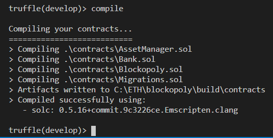

> Nosso projeto precisa do compilador na versão 0.5.5 ou acima.

## Publique o smart contract

Primeiro precisamos criar o novo arquivo com instruções para publicação. 
Ao encontrá-lo, Truffle vai processá-lo no momento do deploy.

### Atualize o arquivo 2_deploy_contracts.js

No diretório `migrations`, já criamos o arquivo `2_deploy_contracts.js` com as instruções para a publicação dos smart contracts `Bank` e `AssetManager`. Dado que os smart contracts já criados anteriormente serão importados no smart contract `Blockopoly`, precisamos apenas fazer a publicação do `Blockopoly`.

Atualize o arquivo para fazer o deploy apenas do smart contract `Blockopoly`.

Substitua por este:

```javascript
var Blockopoly = artifacts.require("Blockopoly");

module.exports = function(deployer) {
  deployer.deploy(Blockopoly);
};
```

Ficará desta maneira: 


### Migrate

No `Truffle development console`, faça a publicação dos contratos especificados no diretório `migrations`.

Utilize o parâmetro `--reset` para publicar novamente todos os smart contracts:

```shell
migrate --reset
```

Veja os resultado específico da publicação do smart contract `Blockopoly`: 

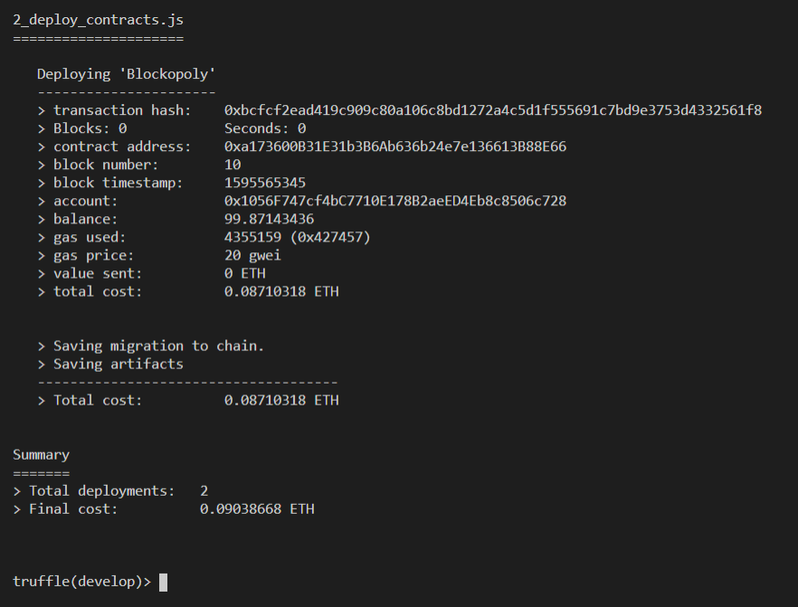

# Interagindo com o smart contract

Vamos interagir com o `Blockopoly` através do Truffle console.

## Suas contas / endereços

No Truffle console:

```javascript
const accounts = await web3.eth.getAccounts()
```

Para listar todas as contas depois:

```javascript
accounts
```

Para olhar cada conta:

```javascript
accounts[0]
accounts[1]
```


## Faça a conexão com Blockopoly

Vamos atribuir a variável `blockopoly` a instância do smart contract `Blockopoly` já publicado:

```javascript
const blockopoly = await Blockopoly.deployed()
```

Verifique se a instância está OK.

Escreva o nome da variável:  `blockopoly`, tecle `.` e depois aperte a tecla TAB duas vezes para acionar o recurso autocompletar. 
Será apresentado o endereço e hash da transação na publicação, além de outras coisas, incluindo todas as váriaveis e métodos públicos disponíveis. 

```javascript
blockopoly. [TAB] [TAB]
```

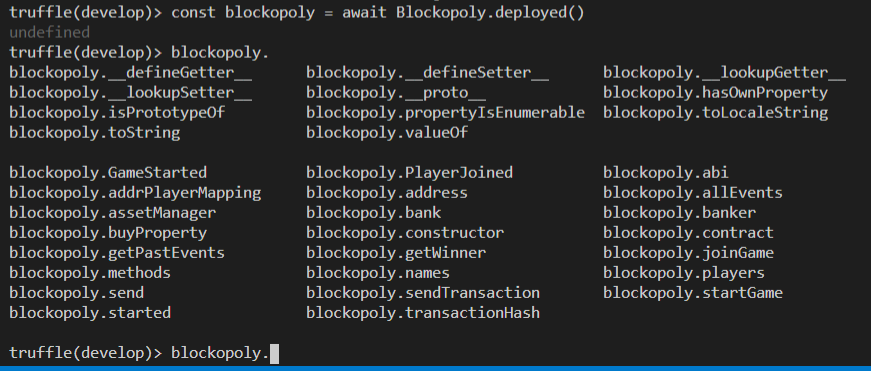

# Vamos jogar!

O objetivo do jogo é se tornar o jogador mais rico através da compra e venda de propriedades.

## Regras do jogo

Estas são as regras do jogo:

1. O banqueiro publica o jogo
2. Os jogadores entram
3. Inicia a partida
4. Os jogadores alternam sua vez para jogar
5. Na sua vez, o jogador escolhe uma propriedade e compra
6. O final do jogo acontece depois de 15 minutos
7. Quem tiver mais dinheiro no final do jogo ganha
8. Se dois jogadores possuírem o mesmo saldo, o critério de desempate é quem se cadastrou primeiro na partida.

## Publicação do jogo

O banqueiro publica o jogo, ou seja, o smart contract `Blockopoly`. 
Esse jogador é responsável por todo o dinheiro e pelas propriedades que ainda pertencem ao banco. 

Por exemplo, eu fiz a publicação a partir da `accounts[0]`, que é `0x1056F747cf4bC7710E178B2aeED4Eb8c8506c728`. 
Esta conta é o banqueiro.
Você pode conferir quem é o banqueiro chamando a função `banker`:

```javascript
blockopoly.banker()
```

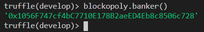

> O banqueiro não pode ser um jogador "normal", quem for o banqueiro fará exclusivamente este papel.

## Entrada dos jogadores

Cada pessoa que desejar participar do jogo deve enviar uma transação chamando a função `joinGame` e informando seu nome. 
A conta que enviou a transação será associada ao nome definido como parâmetro.

### Primeiro Jogador: Ana

A conta `accounts[1]`, que é `0x45a71c00382C2898b5d6Fae69A6F7bfE6EDAB80C`, é da Ana. 
Ela será o primeiro jogador.

Para chamar a função `joinGame`, vou informar o parâmetro `Ana`, além do item extra `from`, que é a definição da conta que está enviando a transação:

```javascript
var transaction01 = await blockopoly.joinGame("Ana", {from: accounts[1]})
```

Guardamos os detalhes da transação na variável `transaction01`. Veja os detalhes:

```javascript
transaction01
```

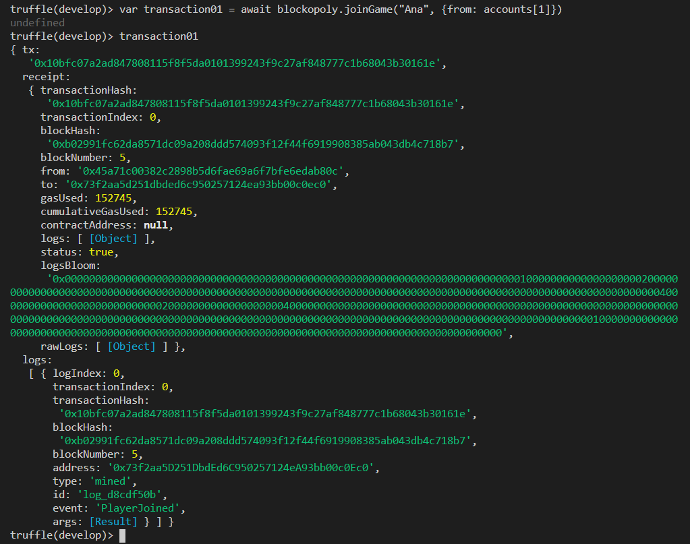

### Evento *PlayerJoined*

Veja os logs da transação `joinGame`. Você encontrará o evento `PlayerJoined`, com os detalhes do jogador:

* '0': Player - endereço  / conta do jogador
* '1': Name - nome do jogador

Veja em nosso exemplo:

```javascript
transaction01.logs
```

Veja o resultado:

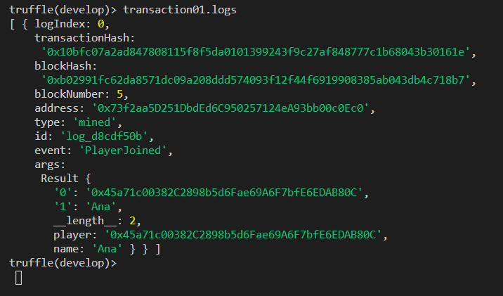

### Variável *addrPlayerMapping*

Uma forma de conferir os dados da jogadora `Ana`, é fazendo uma chamada para o visualizador da variável `addrPlayerMapping`, passando `accounts[1]` como parâmetro.  

```javascript
blockopoly.addrPlayerMapping(accounts[1])
```

São retornados dois parâmetros como resultado:

* '0': addr - endereço  / conta do jogador
* '1': name - nome do jogador

Confira na imagem:

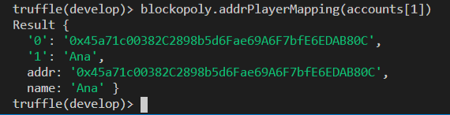

### Segundo Jogador: Ben

A conta `accounts[2]`, que é `0x1596384706dC9Ac4CCa7f50279A4Abe591d6C3FE`, é do Ben. 
Ele será o segundo jogador.

Execute novamente a função `joinGame`, agora com o parâmetro `Ben` e o `from` accounts[2]:

```javascript
var transaction02 = await blockopoly.joinGame("Ben", {from: accounts[2]})
```

Guardamos os detalhes da transação na variável `transaction02`:

```javascript
transaction02
```

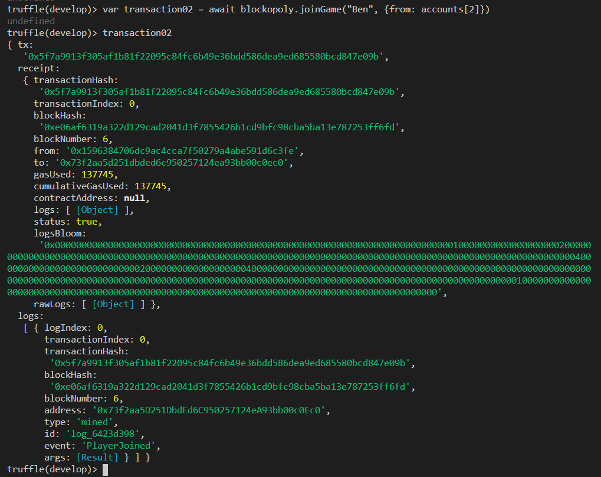

Para conferir se a inclusão foi executada com sucesso, veja o evento:

```javascript
transaction02.logs
```

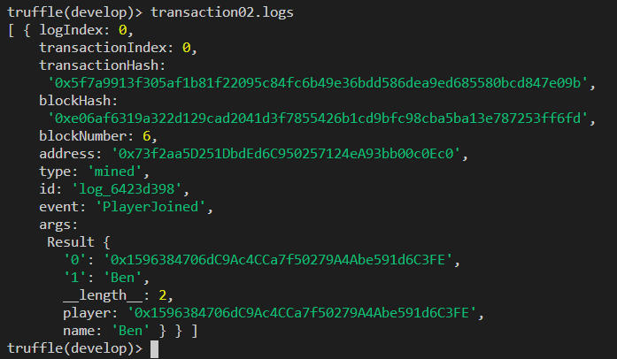

Ou consulte o mapping:

```javascript
blockopoly.addrPlayerMapping(accounts[2])
```

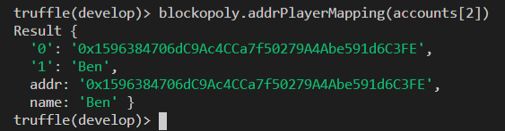

## Início do jogo

Quando todos os participantes já tiverem entrado, o banqueiro inicia o jogo chamando a função `startGame`.

```javascript
blockopoly.startGame({from: accounts[0]})
```

> Neste momento cada jogador recebe 1000 moedas para jogar.

Em nosso jogo, as pessoas jogarão alternadamente, começando na ordem em que se inscreveram através da função `joinGame`. 
Isto é um acordo verbal, mas pode ser implementado no smart contract futuramente.

Então vamos lá! Inicie o jogo a partir da conta do banqueiro. 

```javascript
var transaction03 = await blockopoly.startGame({from: accounts[0]})
```

Veja os detalhes da transação na variável `transaction03`:

```javascript
transaction03
```

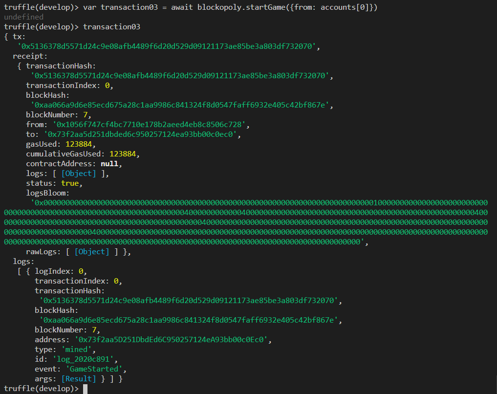

### Evento *GameStarted*

Veja os logs da transação. Você encontrará o evento `GameStarted`, que avisa ao mundo que o jogo começou!

```javascript
transaction03.logs
```


### Variável *Started*

Consulte se o jogo foi iniciado, chamando o visualizador da variável started:

```javascript
blockopoly.started()
```

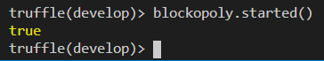

Ele retorna `True`, ou seja, jogo inciado.

> A partir de agora o jogo vai durar 15 minutos!

## Saldos dos jogadores

O smart contract `Bank` é quem controla os saldos dos jogadores.

### Instância do *Bank*

Para verificar um saldo, é preciso instanciar o smart contract `Bank` que foi publicado pelo smart contract `Blockopoly`.

Isto é realizado em 3 passos:

1. Descubra o endereço da publicação realizada para este smart contract
2. Instancie o smart contract já publicado 
3. Verifique se a instância está OK

Vamos detalhar cada passo:

1. Para descobrir o endereço do smart contract `Bank`, faça uma chamada à variável `Bank`:

```javascript
const bankAddress = (await blockopoly.bank()).toString()
```

O retorno será o endereço do smart contract `Bank` publicado pelo smart contract `Blockopoly`, armazenado em `bankAddress`.

```javascript
bankAddress
```

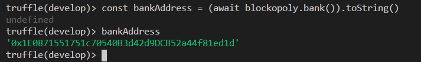

No meu exemplo: `0x1E0871551751c70540B3d42d9DCB52a44f81ed1d`

2. Instancie o smart contract já publicado, a partir do endereço:

```javascript
const bank = await Bank.at(bankAddress)
```

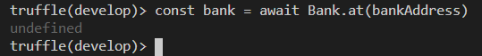

3. Verifique se a instância está OK.

Escreva o nome da variável:  `bank`, tecle `.` e depois aperte a tecla TAB duas vezes para acionar o recurso autocompletar. 
Será apresentado o endereço e hash da transação na publicação, além de outras coisas, incluindo todas as váriaveis e métodos públicos disponíveis. 

```javascript
bank. [TAB] [TAB]
```

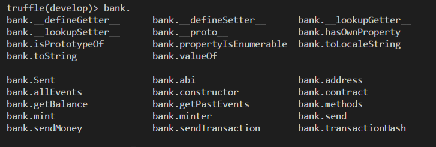

### Emissor

O emissor do banco é a conta que criou o banco, no caso é o smart contract `Blockopoly`.
Na criação do jogo, o próprio smart contract `Blockopoly` é quem faz a emissão de 1000.00 moedas para o banqueiro.
Lembrando que o banqueiro é a conta que fez a publicação do jogo.

```javascript
blockopoly.address
```
Veja que é a mesma conta:

```javascript
bank.minter()
```

Confira na imagem:

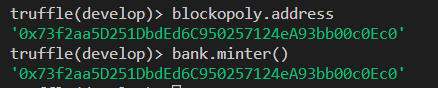

### getBalance

* Escolha o endereço na lista `ACCOUNT`.
* Preencha o endereço no parâmetro ao lado do botão `getBalance` e clique no botão.

No caso, quero saber o saldo das contas accounts[1] e accounts[2], que são os jogadores Ana e Ben.

Para consultar o saldo da conta da Ana:

```javascript
(await bank.getBalance(accounts[1], {from: accounts[1]})).toString()
```

E para consultar o saldo da conta do Ben:

```javascript
(await bank.getBalance(accounts[2], {from: accounts[2]})).toString()
```

Veja os saldos:

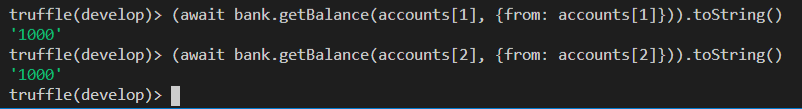

> Apenas o emissor do banco ou o dono da conta pode consultar seu saldo. Dado que emissor do banco é quem criou o banco, no caso é o smart contract `Blockopoly`, manualmente apenas o jogador pode consultar seu saldo.

Se você tentar consultar o saldo sem definir o `from`, a transação será enviada a partir da conta default, que é `accounts[0]`, do criador do jogo, o banqueiro. A consulta retornará um erro:

```javascript
(await bank.getBalance(accounts[1])).toString()
```

Aqui está o erro:

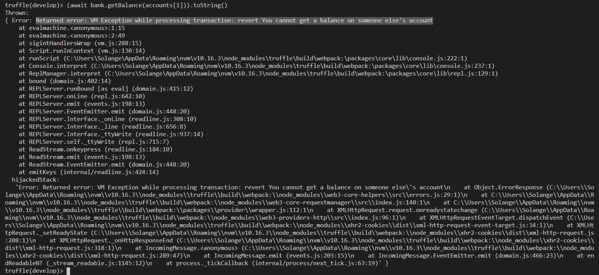

> Mais informações sobre o smart contract `Bank`, podem ser encontradas na [parte 1](/2020/blockopoly-01/) deste tutorial.

## Propriedades disponíveis

O smart contract `AssetManager` é quem gerencia as propriedades disponíveis.

Não foi implementada uma função para listar as propriedades disponíveis. Este controle será realizado fora do Blockchain, fazendo parte da estratégia do jogo controlar as propriedades, por enquanto.

### Instância do *AssetManager*

É preciso instanciar o smart contract `AssetManager` que foi publicado pelo smart contract `Blockopoly`, da mesma forma que fizemos com o contrato `Bank`.

1. Para descobrir o endereço do smart contract `AssetManager`, faça uma chamada à variável `AssetManager`:

```javascript
const assetManagerAddress = (await blockopoly.assetManager()).toString()
```

O retorno será o endereço do smart contract `AssetManager` publicado pelo smart contract `Blockopoly`, armazenado em `assetManagerAddress`.

```javascript
assetManagerAddress
```

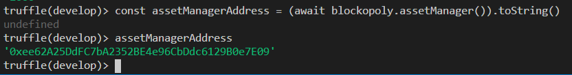

No meu exemplo: `0xee62A25DdFC7bA2352BE4e96CbDdc6129B0e7E09`

2. Instancie o smart contract já publicado, a partir do endereço:

```javascript
const assetManager = await AssetManager.at(assetManagerAddress)
```

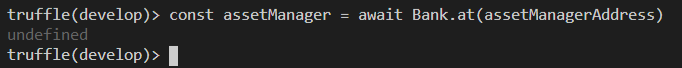

3. Verifique se a instância está OK.

Escreva o nome da variável:  `assetManager`, tecle `.` e depois aperte a tecla TAB duas vezes para acionar o recurso autocompletar. 
Será apresentado o endereço e hash da transação na publicação, além de outras coisas, incluindo todas as váriaveis e métodos públicos disponíveis. 

```javascript
assetManager. [TAB] [TAB]
```

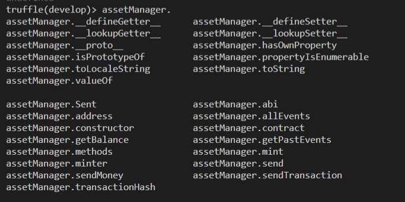

### Dono de uma propriedade

Para saber quem é o dono de uma propriedade, utilize a função `getOwner`. Preencha o parâmetro nome da propriedade.

Por exemplo, veremos o proprietário de `Sao Paulo Reactor`:

```javascript
assetManager.getOwner("Sao Paulo Reactor")
```

É a `accounts[0]`, do banqueiro.

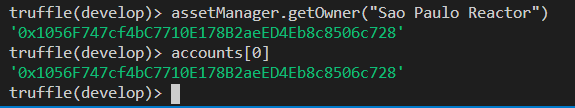

No início do jogo, ele é o proprietário de todas as propriedades. Veja mais um, `Redmond Reactor`:

```javascript
assetManager.getOwner("Redmond Reactor")
```

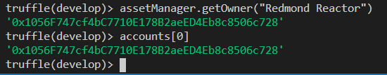

> Isto foi explicado no smart contract `AssetManager`, criado na [parte 2](/2020/blockopoly-02/) deste tutorial. 

## Comprando uma propriedade

Alternadamente, cada jogador vai comprar uma propriedade.
Ao chegar a sua vez, o jogador vai escolher a propriedade que deseja comprar. 

Utilize a função `buyProperty` para comprar uma propriedade.

### Primeira compra: "Sao Paulo Reactor"

Ana, identificada pela `accounts[1]`, comprará "Sao Paulo Reactor"

```javascript
var transaction04 = await blockopoly.buyProperty("Sao Paulo Reactor", {from: accounts[1]})
```

Veja os detalhes da transação na variável `transaction04`:

```javascript
transaction04
```
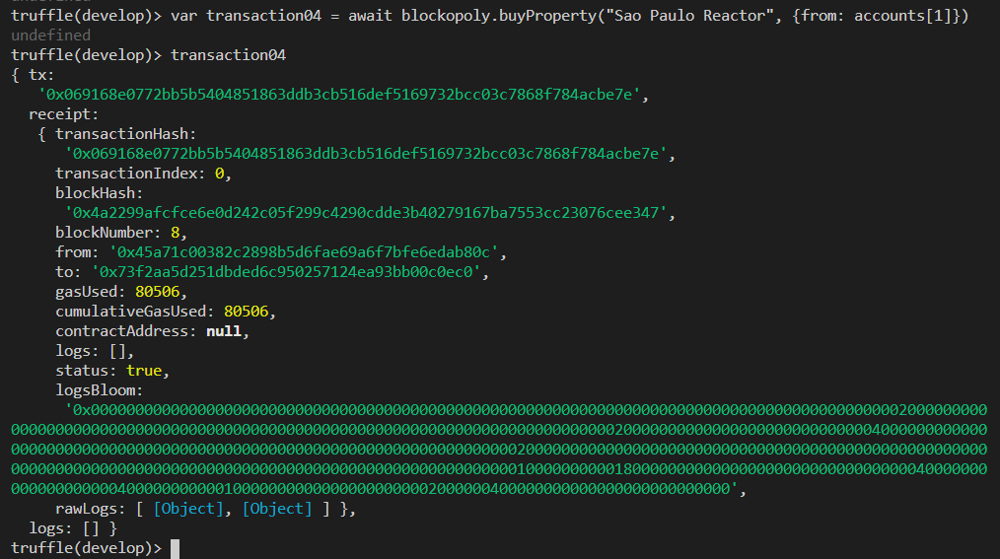

### Eventos

Esta transação emite 2 eventos, porém de maneira indireta, porque um deles é emitido pelo smart contract `bank` e o outro pelo smart contract `assetManager`:

* `Sent` - emitido por `bank` - o envio de moedas para a compra
* `AssetTransfered` - emitido por `assetManager` - a transferência da propriedade de um endereço para outro

Para ver estes eventos, é necessário visualizar a parte `rawLogs` do `receipt`, que seria o retorno da transação:

```javascript
transaction04.receipt.rawLogs
```

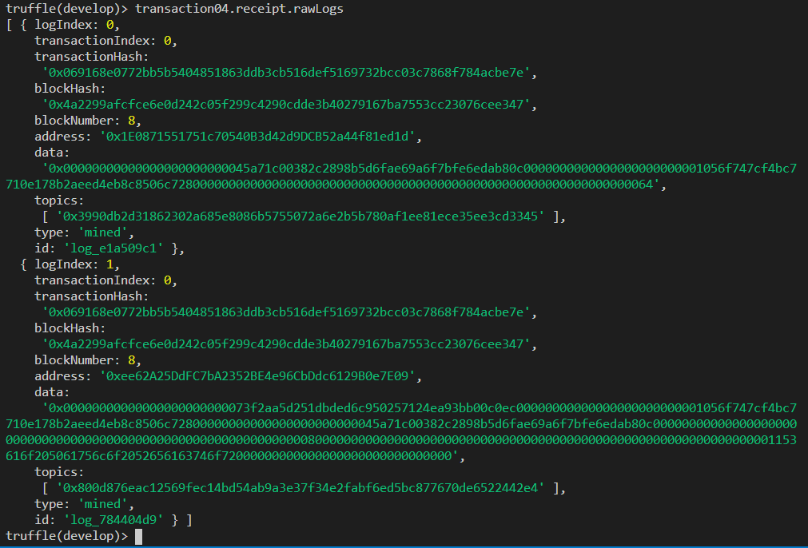

É um pouco mais difícil de identificar, mas são estes:

* logIndex: 0 - é o evento `Sent`, emitido pelo `bank`
* logIndex: 1 - é o evento `AssetTransfered`, emitido pelo `assetManager`

### Outra compra: "Redmond Reactor" 

Ben, identificado pela `accounts[2]`, comprará "Redmond Reactor".

```javascript
var transaction05 = await blockopoly.buyProperty("Redmond Reactor", {from: accounts[2]})
```

Veja a transação:

```javascript
transaction05
```

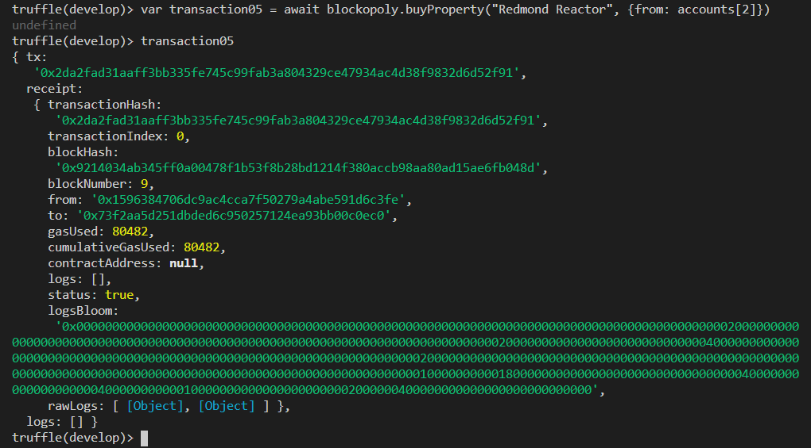

### Continuando as compras 

Depois Ana escolherá outra propriedade para comprar, e assim sucessivamente, até acabar o tempo.

## Algumas dicas

* Faz parte do jogo cada um ter seu controle de propriedades ainda disponíveis.
* Se um jogador tentar comprar uma propriedade que já é sua, ele terá desperdiçado a sua vez.
* Melhor comprar as propriedades do banco primeiro!
* Quando um jogador compra uma propriedade de outro jogador ao invés de comprar do banco, ele está pagando para outro jogador, ou seja, está aumentando o saldo do outro, então esta não é a melhor estratégia.
* A qualquer momento você pode consultar uma propriedade para saber quem é o seu dono.
* Você não pode consultar o saldo de outra pessoa.

## Término do jogo

Foi definido no smart contract `Blockopoly` que o jogo encerra 15 minutos após seu início.
E quem tiver mais dinheiro no final do jogo ganha.

Os jogadores vão alternando a sua vez. Em algum momento, quando o jogador tentar comprar uma propriedade, não vai conseguir e o retorno será um erro com a mensagem `Game over`.

Isto pode ser acompanhado na tentativa de execução da transação:

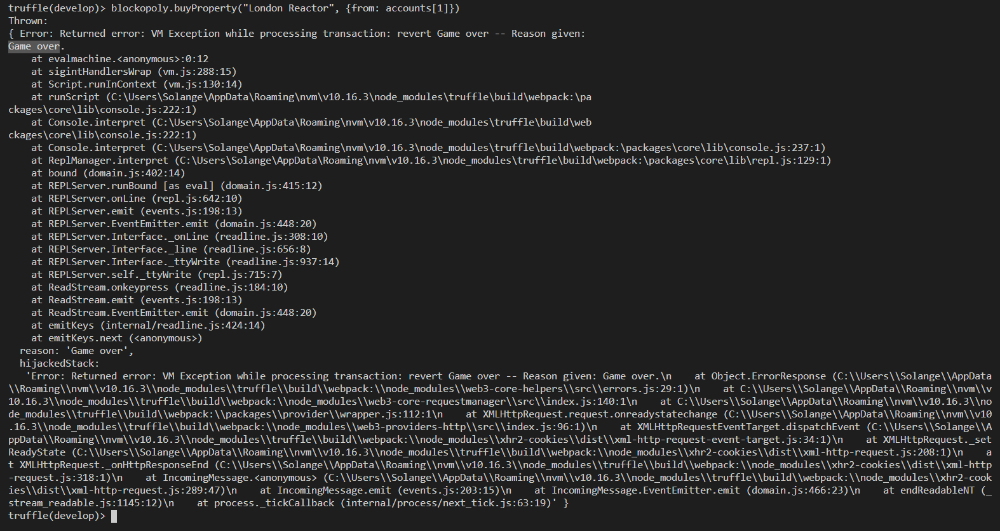

## Ganhador

Após receber a mensagem `Game over`, chame a função `getWinner` para descobrir o ganhador da partida.

```javascript
blockopoly.getWinner()
```

**Ana ganhou!**

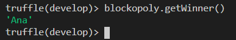

> Se dois jogadores possuírem o mesmo saldo, o critério de desempate é quem se cadastrou primeiro na partida.

# Próximos passos - upgrades

Existem diversas melhorias que podem ser implementadas nos smart contracts do jogo `Blockopoly`.

Aqui estão algumas sugestões:

### Cadastro múltiplo

Atualmente a mesma conta / endereço pode se cadastrar 2x, isto não é correto. Como você pode corrigir isto?

### Fim de jogo

Atualmente, a única forma de saber que o jogo acabou é quando um jogador tenta comprar uma propriedade e não consegue. Neste momento, deve-se verificar se a mensagem de erro é `Game over`. VOcê acha isto correto, ou seria melhor que os jogadores pudessem consultar o status d jogo antes de tentar comprar uma propriedade?

### Propriedades disponíveis

Não saber explicitamente quais as propriedades que ainda estão em propriedade do banco faz parte da estratégia do jogo, pois cada um deveria fazer este controle, dado que comprar propriedade de outro jogador é uma desvantagem em relação a comprar propriedade do banco.

Mas você pode mudar isto, implementando uma função para listar as propriedades disponíveis, que ainda são do banco.

### Ordem dos jogadores

Em nosso jogo, os participantes jogarão alternadamente, começando na ordem em que se inscreveram através da função `joinGame`. Isto é um acordo verbal, mas pode ser implementado no smart contract futuramente.

Ou... pode ser feito um sorteio do próximo jogador.

Qual você prefere implementar?

# Publicando em Blockchain

Para interagir com seus amigos e cada um utilizar a sua wallet, você precisa publicar o smart contract em um Blockchain "de verdade", ou seja, uma rede pública ou privada na qual todos tenham acesso.

Algumas opções:

* Ehtereum 1.0: Testnet Ropsten ou Testnet Rinkeby
* Azure Blockchain Development Kit
* RSK: Testnet

# Considerações finais

Na [parte 1](../Tutorial_part01/README.md) você conheceu a arquitetura do projeto e o primeiro smart contract: `Bank`, que controla o dinheiro, os saldos de cada um, a emissão e transferências.

Na [parte 2](../Tutorial_part02/README.md) foi ensinado como criar o smart contract `AssetManager`, nosso gerenciador de ativos que é o administrador das propriedades negociadas. 

Nesta terceira e última parte do tutorial criamos o "coração" do projeto que é o smart contract `Blockopoly`, onde são definidos jogadores, propriedades negociadas, início, final do jogo e ganhador. Além disto, demonstramos o funcionamento de uma partida.

O projeto `Blockopoly` é uma iniciativa da Microsoft: [Reactor](https://developer.microsoft.com/en-us/reactor/) e o código original encontra-se no [Github Reactors](https://github.com/microsoft/Reactors), sob [licença MIT](https://github.com/microsoft/Reactors/blob/main/LICENSE). 
