# Learn_Solidity : Crie contratos inteligentes no Blockchain Ethereum usando Solidity

Por: [Solange Gueiros](https://www.linkedin.com/in/solangegueiros/)

Contratos inteligentes (smart contracts) são programas de computador auto-executáveis e publicados em Blockchain que validam regras de negócio, seja para a transferência de ativos digitais, tokens ou criptomoedas ou ainda registro de informações em Blockchain.

Para conhecer os princípios de Blockchain, veja o workshop [Build_Smart_Contracts - Crie contratos inteligentes no Blockchain](./Build_Smart_Contracts/README.md). 

Neste workshop, você usará a linguagem de programação [Solidity](https://solidity.readthedocs.io/) para desenvolver seus próprios contratos inteligentes no Blockchain Ethereum. Construiremos um gerenciador de tarefas utilizando VSCode and Truffle, apresentando os principais conceitos de Solidity.


Imagem [Pixabay](https://pixabay.com): [https://pixabay.com/illustrations/sticky-notes-post-it-notes-sticky-938602/](https://pixabay.com/illustrations/sticky-notes-post-it-notes-sticky-938602/)

# Tutorial: projeto Task Manager

Aqui está um resumo das etapas que faremos neste tutorial:

1. Instalação de pré requisitos;
2. Configurar um projeto utilizando Truffle;
3. Arquitetura do projeto;
4. Criar um smart contract; 
5. Conceitos de Solidity;
6. Compilar e publicar um smart contract;
7. Interagir com o smart contract através do Truffle console.
8. Próximos passos - upgrades;
9. Publicando em Blockchain;
10. Considerações finais.

# Pré-requisitos

* Git
* Node.js e NPM (Node Package Manager)
* Visual Studio Code (VSCode)
* Extensão VSCode para a linguagem Solidity
* Truffle

## Git

`Git` é um sistema open-source de controle de versão. Alguns pacotes que serão instalados posteriormente utilizam o Git internamente para fazer download de suas versões corretas.

Além disto, no sistema operacional (SO) Windows, é instalado com ele um terminal POSIX, chamado `Git Bash`, que é o próximo pré-requisito. 

Instale o [Git para Windows](https://gitforwindows.org/), que inclui o terminal Git Bash. 

Este [tutorial on installing and using Git Bash](https://www.atlassian.com/git/tutorials/git-bash) (em inglês) também pode ajudar.

## Node.js e NPM

Uma das dependências é NPM, que é instalado com Node.js.

Pra verificar se Node.js e NPM já estão instalados, utilize os comandos abaixo no terminal:

```shell
node --version
npm --version
```


Vá em [Node.js](https://nodejs.org/en/) caso precise instalá-los.

Caso queira ter mais de uma versão do node instalada, utilize o gerenciador de versões para o node, chamado [nvm](https://github.com/nvm-sh/nvm).

## Visual Studio Code (VS Code)

Precisamos de algum editor de código, de preferência um que destaque as linguagens Solidity e Javascript.

[VS Code](https://code.visualstudio.com/) é uma boa escolha.

Para instalar, [faça o download](https://code.visualstudio.com/download).

Verifique se a instalação do VS code está ok consultando sua versão no terminal:

```shell
code -v
```

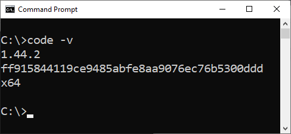

## Extensão VSCode para a linguagem Solidity

No VSCode, vá em Extensions (Menu View -> Extensions).

1. Digite `solidity` no campo de pesquisa.
2. Selecione a extensão `solidity` do Juan Blanco.
3. Clique em `install`.

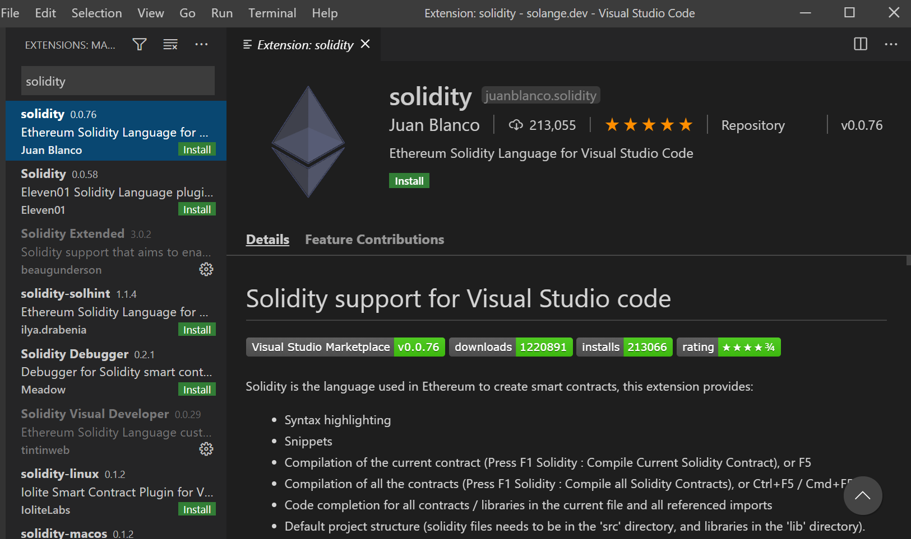

## Truffle

[Truffle](https://www.trufflesuite.com/truffle) é um conhecido framework para desenvolvimento de smart contracts, que facilita a vida do desenvolvedor.
Entre suas características, podemos citar o gerenciamento da "vida" de um smart contract (você pode fazer várias publicações e saber qual foi a última), desenvolvimento de scripts para deploy, testes automatizados e gerenciamento de rede simplificado.

Da mesma forma também facilita o desenvolvedor RSK porque podemos configurar as redes RSK no Truffle.

Para instalar Truffle, no terminal, digite o comando abaixo no terminal e pressione a tecla `enter`:

```shell
npm install -g truffle
```


Quando a instalação finalizar, feche a janela do terminal e abra novamente para verificar a versão do Truffle:

```shell
truffle version
```

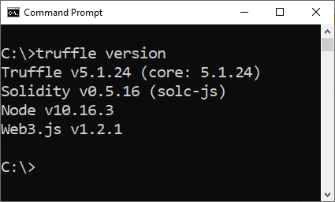

# Configurar um projeto utilizando Truffle

Crie uma nova pasta chamada `TaskManager`:

```shell
mkdir TaskManager
cd TaskManager
```
Por exemplo, eu vou criar em `C:\ETH\` (Estou utilizando Windows).

Meu projeto estará localizado no diretório `C:\ETH\TaskManager`.

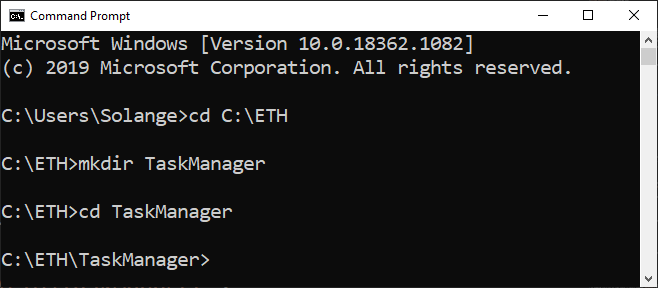

## Inicialize um projeto Truffle 

Na pasta do seu projeto, inicialize um projeto Truffle:

```shell
truffle init
```

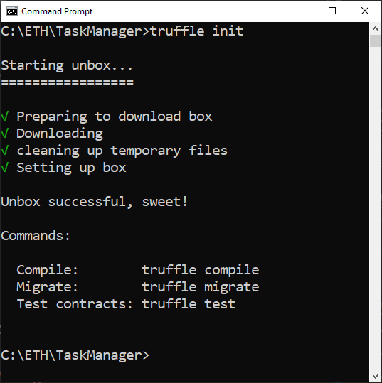

## Abra o projeto no VS Code

Abra a pasta no VSCode. 

```shell
code .
```

Você verá uma estrutura de diretórios como esta:

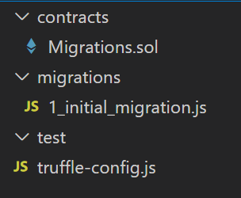

* `./contracts`: Todos os smart contracts serão salvos nesta pasta.
* `./migrations`: Os scripts para publicação ficarão armazenados aqui.
* `./test`: Aqui serão salvos os scripts para testes.
* `./truffle-config.js`: Este é o arquivo de configuração do Truffle. Aqui vamos configurar as redes de Blockchain.

Veja que os seguintes arquivos também foram criados:

* `Migrations.sol`: Smart contract que registra todos as publicações realizadas em uma rede.
* `1_initial_migration.js`: Publicação do `Migrations.sol`.

## Inicialize um projeto npm

Quando inicializamos um projeto Truffle, também precisamos inicializar um projeto npm.

Podemos fazer isto diretamente no terminal do VS Code. Vá no menu `Terminal` e selecione `New Terminal`.

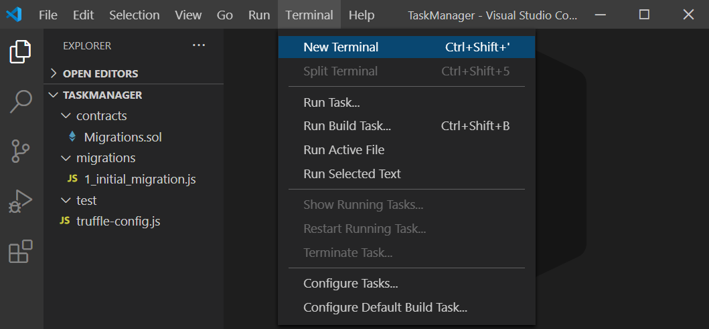

Para inicializar um projeto npm na mesma pasta, execute o comando abaixo no terminal:

```shell
npm init -y
```

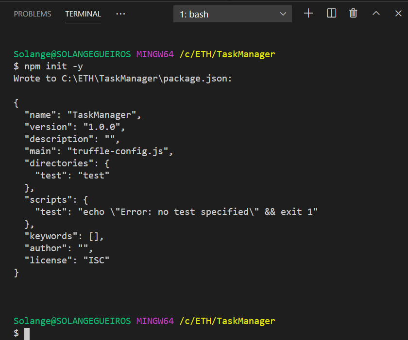

Este comando cria um arquivo de configurações chamado `package.json`.

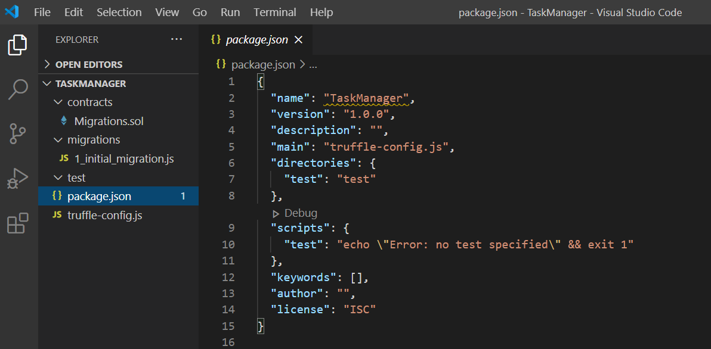

## Configurando Truffle

No diretório do projeto, abra o arquivo `truffle-config.js` no VS Code e sobrescreva como o seguinte código:

```javascript
module.exports = {

  networks: {
  },

  compilers: {
    solc: {
      version: "0.5.4"
    }
  }
}
```

## Truffle development console

Truffle possui um console interativo que inclui um blockchain de desenvolvimento. Isso é muito útil para compilar, publicar e testar localmente.

Execute o console de desenvolvimento digitando o seguinte comando no terminal do VS Code:

```shell
truffle develop
```

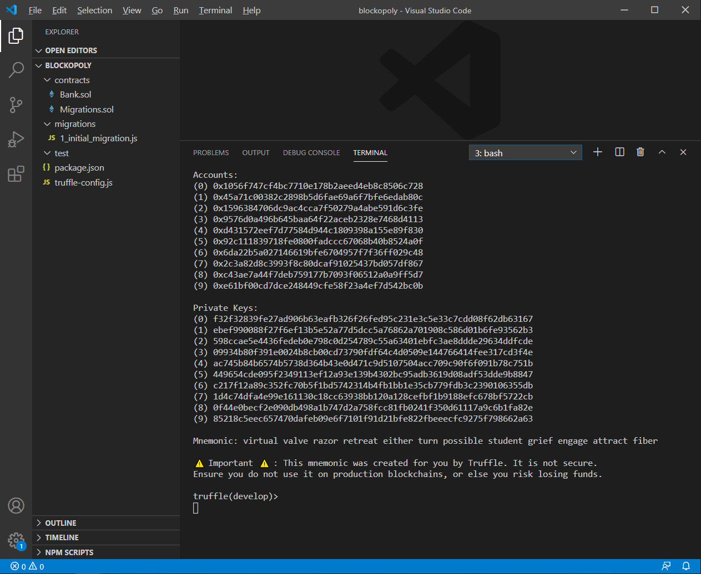

> Os comando Truffle podem ser executados dentro ou fora do console de desenvolvimento.
> 
> Se estamos no console de desenvolvimento Truffle, não precisamos iniciar os comandos com `truffle`. 
> 
> Por exemplo, se fora do console utilizamos `truffle test`, dentro do console usamos apenas `test`.

Quando quiser sair do Truffle console, digite:

```shell
.exit
```

# O projeto

Nosso projeto é composto por apenas um smart contract: 

* TaskManager

Apresentaremos as regras de negócio que definirão o smart contract.

## TaskManager

Cada tarefa terá uma estrutura com as seguintes informações:

* dono da tarefa, representado pelo seu endereço
* name
* phase
* priority

Nossas tarefas serão classificadas de acordo com a fase que elas estão:

* ToDo, 
* InProgress, 
* Done, 
* Blocked, 
* Review, 
* Postponed, 
* Canceled

Regras de negócio:

1. Cada pessoa, representada por sua conta / endereço Ethereum, pode ter várias tarefas.
2. Quando uma tarefa for adicionada, um evento será emitido, ou seja qualquer sistema que esteja monitorando o Blockchain pode acompanhar a criação de tarefas.
3. Dado um índice da tarefa, queremos saber seus detalhes: dono, nome, fase e prioridade.
4. Queremos ter uma lista com os índices de todas as nossas tarefas. 
5. Cada pessoa só pode ver a sua lista de tarefas.
6. Qualquer pessoa pode adicionar uma tarefa para si mesma, mas não pode adicionar para outra pessoa.
7. Depois que uma tarefa for criada, a única coisa que pode ser alterada é a sua fase.

# Crie o smart contract

No diretório `Contracts`, crie um arquivo chamado `TaskManager.sol`.

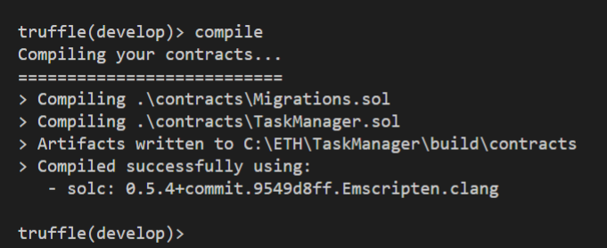

## arquivo TaskManager.sol

Copie e cole o smart contract do código abaixo:

```javascript
pragma solidity 0.5.4;

contract TaskManager {

    uint public nTasks;
    
    //enum TaskPhase {ToDo = 0, InProgress = 1, Done = 2, ...}
    enum TaskPhase {ToDo, InProgress, Done, Blocked, Review, Postponed, Canceled}
    
    struct TaskStruct {
        address owner;
        string name;
        TaskPhase phase;
        // Priority 1-5: 1 higher, 5 less important
        uint priority;
    }
    TaskStruct[] private tasks;
    //TaskStruct[] public tasks;
    
    mapping (address => uint[]) private myTasks;
    //mapping (address => uint[]) public myTasks;

    event TaskAdded(address owner, string name, TaskPhase phase, uint priority);
    
    modifier onlyOwner (uint _taskIndex) {
         if  (tasks[_taskIndex].owner == msg.sender) {
           _;
        }
    }
    
    constructor() public {
        nTasks = 0;      
        addTask ("Create Task Manager", TaskPhase.Done, 1);
        addTask ("Create Your first task", TaskPhase.ToDo, 1);
        addTask ("Clean your house", TaskPhase.ToDo, 5);
    }    

    function getTask(uint _taskIndex) public view
        returns (address owner, string memory name, TaskPhase phase, uint priority) {
        
        owner = tasks[_taskIndex].owner;
        name = tasks[_taskIndex].name;
        phase = tasks[_taskIndex].phase;
        priority = tasks[_taskIndex].priority;
    }
    
    function listMyTasks() public view returns (uint[] memory) {
        return myTasks[msg.sender];
    }
    
    function addTask(string memory _name, TaskPhase _phase, uint _priority) public returns (uint index) {
        require ((_priority >= 1 && _priority <=5), "priority must be between 1 and 5");
        TaskStruct memory taskAux = TaskStruct ({
            owner: msg.sender,
            name: _name,
            phase: _phase, 
            priority: _priority
        });
        index = tasks.push (taskAux) - 1;
        nTasks ++;
        myTasks[msg.sender].push(index);
        emit TaskAdded (msg.sender, _name, _phase, _priority);
    }
    
    function updatePhase(uint _taskIndex, TaskPhase _phase) public onlyOwner(_taskIndex) {
        tasks[_taskIndex].phase = _phase;
    }
    
}
```

Salve o arquivo.

# Aprendendo Solidity

Os smart contracts escritos em Solidity são semelhantes às classes em linguagens orientadas a objetos. Cada contrato pode conter declarações de variáveis de estado, funções, modificadores de função, eventos, tipos estrutura e tipos enum. Além disso, os contratos podem herdar características de outros contratos.

### Pragma solidity

Todo arquivo solidity deve começar definindo qual a versão de compilador será utilizada. Isto é realizado com a seguinte instrução.

```javascript
pragma solidity 0.5.4;
```

No caso utilizaremos a versão de compilador `0.5.4`.

Você pode ver a documentação específica de cada versão, como por exemplo, para a versão [0.5.4](https://solidity.readthedocs.io/en/v0.5.4/).

### Contract

A instrução `contract` declara o smart contract. Definimos seu nome e depois tudo o que estiver entre as chaves `{}` é o conteúdo dele.

```javascript
contract TaskManager {

}
```

### Variáveis de estado

Variáveis de estado guardam o estado do smart contract, ou seja, informações que são armazenados permanentemente no contrato inteligente.

Em nosso projeto temos a variável `nTask`, que é do tipo inteiro sem sinal, armazena apenas números. Sua visibilidade é pública. Ela será utilizada para guardar o número de tarefas de nosso sistema.

```javascript
uint public nTasks;
```

> Termine todos os seus comandos com um ponto-e-vírgula `;`

### Tipos enumerados

`enum` é utilizado para criar um tipo definido pelo usuário no Solidity. 
Eles são explicitamente conversíveis de e para todos os tipos de inteiros, mas a conversão implícita não é permitida.
O primeiro valor do enum é representado pelo inteiro sem sinal `0`.

As fases do nosso projeto são definidas no enum `TaskPhase`:

```javascript
//enum TaskPhase {ToDo = 0, InProgress = 1, Done = 2, ...}
enum TaskPhase {ToDo, InProgress, Done, Blocked, Review, Postponed, Canceled}
```

### Estruturas

`struct` é um tipo definido pelo usuário que pode agrupar diversas variáveis.

Em nosso projeto criamos a struct `TaskStruct`, que contém as variáveis:

```javascript
struct TaskStruct {
    address owner;
    string name;
    TaskPhase phase;
    // Priority 1-5: 1 higher, 5 less important
    uint priority;
}
```

### Array

Um `array` é uma estrutura de dados que armazena uma coleção de elementos de um determinado tipo de tal forma que cada um dos elementos possa ser identificado por um índice, que é sua posição no array.
O primeiro elemento de um array é acessado pelo índice `0`.

Nosso projeto contém um array de structs chamado tasks. 
Ou seja, cada posição do array contém uma struct com as informações definidas na struct: owner, name, phase e priority.

```javascript
TaskStruct[] private tasks;
```

### Mapping

Um `mapping` é uma estrutura do tipo `chave-valor`, ou seja, dada uma chave, ela retorna um valor.

Em nosso projeto, temos o mapping `myTasks`, com a chave identificadora sendo do tipo endereço.
Para cada endereço armazenado no mapping, será retornado um array de números, que são as posições na lista de tarefas que são deste endereço. Ou seja, retorna os índices do array tasks.

```javascript
mapping (address => uint[]) private myTasks;
```

### Eventos

Os eventos em Solidity são um envio de log para o mudo externo. Os aplicativos podem monitorar eventos por meio da interface RPC de um cliente Ethereum.

Em nosso projeto, quando uma tarefa for adicionada, um evento será emitido, ou seja, qualquer sistema que esteja monitorando o Blockchain pode acompanhar a criação de tarefas.

```javascript
event TaskAdded(address owner, string name, TaskPhase phase, uint priority);
```

Para chamar um evento posteriormente, em uma função, utilize o comando `emit`, por exemplo:

```javascript
emit TaskAdded (msg.sender, _name, _phase, _priority);
```

### Modificadores de função

`modifier` é utilizado para alterar o comportamento das funções.  Por exemplo, eles podem verificar automaticamente uma condição antes de executar a função. 

Nosso projeto tem o modifier `onlyOwner`, que será utilizado para que somente o owner possa acessar uma tarefa a partir do seu índice.

```javascript
modifier onlyOwner (uint _taskIndex) {
      if  (tasks[_taskIndex].owner == msg.sender) {
        _;
    }
}
```

Que será utilizado para que somente o owner possa alterar a fase de uma tarefa:

```javascript
function updatePhase(uint _taskIndex, TaskPhase _phase) public onlyOwner(_taskIndex) {
    tasks[_taskIndex].phase = _phase;
}
```

### Construtor

* O `constructor` (construtor) é executado apenas no momento da criação do smart contract.

Costuma-se utilizar para definir o estado inicial de variáveis de estado do contrato inteligente.

Em nosso projeto, adicionaremos algumas tarefas como exemplo para a pessoa / endereço que publicou o smart contract na rede.
Também inicializamos a variável nTasks com o valor 0 (é o padrão, mas estamos garantindo que vai começar com o valor que desejamos);

```javascript
constructor() public {
    nTasks = 0;  
    addTask ("Create Task Manager", TaskPhase.Done, 1);
    addTask ("Create Your first task", TaskPhase.ToDo, 1);
    addTask ("Clean your house", TaskPhase.ToDo, 5);
}
```

# Funções

### getTask

Dado um índice da tarefa, queremos saber seus detalhes: dono, nome, fase e prioridade.

```javascript
function getTask(uint _taskIndex) public view
    returns (address owner, string memory name, TaskPhase phase, uint priority) {

    owner = tasks[_taskIndex].owner;        
    name = tasks[_taskIndex].name;
    phase = tasks[_taskIndex].phase;
    priority = tasks[_taskIndex].priority;
}
```

### listMyTasks

Queremos ter uma lista com os índices de todas as nossas tarefas. 

```javascript
function listMyTasks() public view returns (uint[] memory) {
    return myTasks[msg.sender];
}
```

Perceba que o retorno é o mapping utilizando a chave `msg.sender` , ou seja, cada pessoa só pode ver a sua lista de tarefas.

### addTask

Temos uma função para adicionar uma nova tarefa. Para isto precisamos definir todas as informações da estrutura Task`Struct`.

Qualquer pessoa pode adicionar uma tarefa para si mesma, mas não pode adicionar para outra pessoa porque quando adicionamos uma tarefa, o owner é quem está enviando a transação, ou seja, o `msg.sender`.

No final da função existe uma chamada para evento `TaskAdded`, avisando ao mundo que a tarefa foi criada.

```javascript
function addTask(string memory _name, TaskPhase _phase, uint _priority) public returns (uint index) {
    require ((_priority >= 1 && _priority <=5), "priority must be between 1 and 5");

    TaskStruct memory taskAux = TaskStruct ({
        owner: msg.sender,
        name: _name,
        phase: _phase, 
        priority: _priority
    });
    index = tasks.push (taskAux) - 1;
    nTasks ++;
    myTasks[msg.sender].push(index);

    emit TaskAdded (msg.sender, _name, _phase, _priority);
}
```

### updatePhase

Depois que uma tarefa for criada, a única coisa que pode ser alterada é a sua fase. 

Na declaração da função é utilizado o modificador `onlyOwner` definido anteriormente. Ou seja, apenas quem criou a tarefa pode alterar a sua fase.

```javascript
function updatePhase(uint _taskIndex, TaskPhase _phase) public onlyOwner(_taskIndex) {
    tasks[_taskIndex].phase = _phase;
}
```

# Tratamento de Erros em Solidity

A linguagem Solidity faz o tratamento de erros com uma reversão de estado quando um erro ou uma exceção acontece. 

Uma exceção irá desfazer todas as alterações feitas no estado na chamada de função atual (incluindo todas as suas sub-chamadas) e também enviar um erro para quem chamou a função.

* Assert - trata erros internos, previne condições que não deveria acontecer em um código bem escrito ou verifica invariantes, por exemplo: balance > totalSupply (nunca o saldo poderia ser maior que a emissão total). 
* Require - garante que condições sejam atendidas, como entradas ou variáveis de estado do contrato, ou validar valores de retorno de chamadas de contratos externos.  
* Revert - usado para verificar se houve um erro na chamada de uma função. Avisa o erro e reverte a chamada atual. Pode-se fornecer uma mensagem contendo detalhes do erro que será repassada à quem chamou a função.

### Require

Dentro da função `addTask` existe um `require`, que garante que a prioridade de uma tarefa seja entre os números 1 e 5.

# Compile o smart contract

Vamos compilar o smart contract `TaskManager.sol`. 
No `Truffle development console`, digite:

```shell
compile
```

Veja o resultado com a mensagem `Compiled successfully`:


# Publique o smart contract

Primeiro precisamos criar um novo arquivo com instruções para publicação. 
Ao encontrá-lo, Truffle vai processá-lo no momento do deploy.

## Crie o arquivo 2_deploy_contracts.js

O diretório `migrations` contém arquivos JavaScript que auxiliam a publicação de contratos no blockchain. 
Estes arquivos são responsáveis pelo preparo das tarefas de implantação e são escritos com base no pressuposto de que suas necessidades de implantação podem mudar com o tempo. 
O histórico das publicações executadas anteriormente é salvo no blockchain através de um contrato especial criado automaticamente pelo Truffle, chamado Migrations. 
(source: [running migrations](https://www.trufflesuite.com/docs/truffle/getting-started/running-migrations))

Usualmente começamos o nome do arquivo com um número, dado que o Truffle faz o deploy dos arquivos em ordem alfabética e desta forma definimos a ordem de publicação dos smart contracts.

Na pasta `migrations`, crie o arquivo `2_deploy_contracts.js`

Copie e cole:

```javascript
var TaskManager = artifacts.require("TaskManager");

module.exports = function(deployer) {
  deployer.deploy(TaskManager);
};
```

Veja o resultado: 

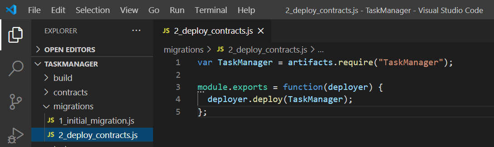

### Migrate

No `Truffle development console`, execute este comando:

```shell
migrate
```

Como este é um simulador, rapidamente as transações da publicação do smart contract são gravadas no Blockchain, não há necessidade de esperar para validação e inclusão da transação em um bloco.

Se for necessário, o comando `migrate` vai compilar os smart contracts novamente.

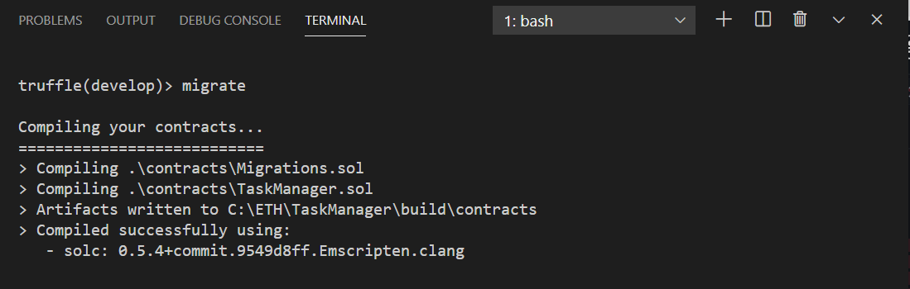

Primeiro é executada a publicação do smart contract `Migrations.sol`, que foi gerado pelo Truffle:

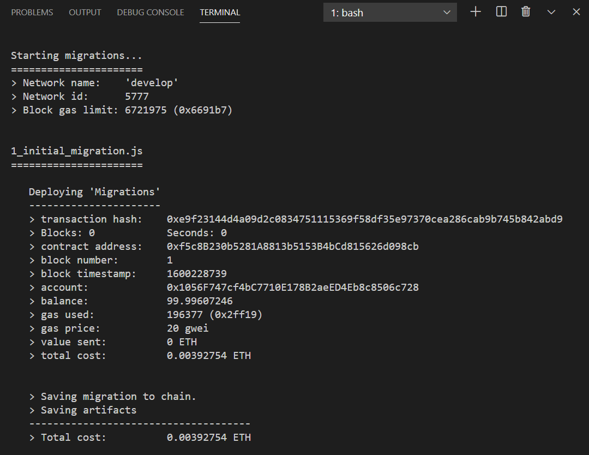

E depois faz publicação do nosso smart contract `TaskManager.sol`:

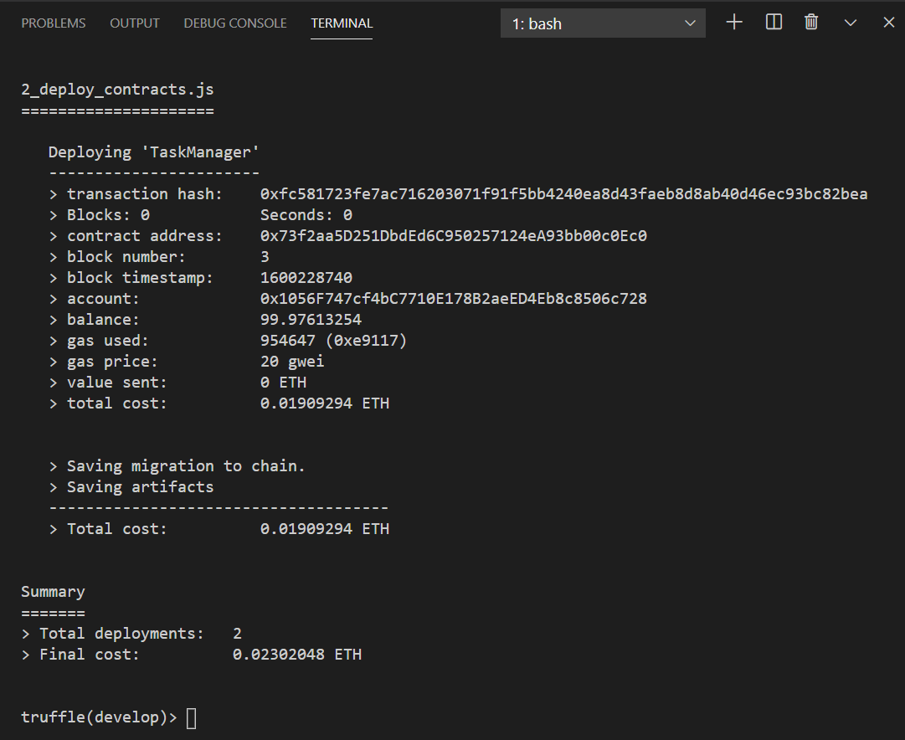

## Interagindo com o smart contract

Vamos interagir com nosso `TaskManager` através do Truffle console.

## Suas contas / endereços

No Truffle console:

```javascript
const accounts = await web3.eth.getAccounts()
```

Se  o retorno for `undefined`, está ok.

Para listar todas as contas depois:

```javascript
accounts
```

Para olhar uma conta, por exemplo, accounts[0]:

```javascript
accounts[0]
```

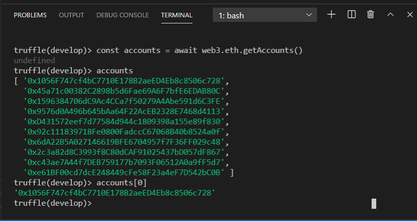

## Faça a conexão com o TaskManager

No Truffle console:

```javascript
const taskManager = await TaskManager.deployed()
```

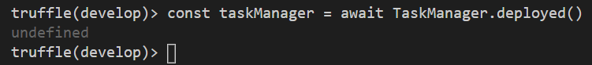

Verifique se a instância está OK.

Escreva o nome da variável:  `taskManager`, tecle `.` e depois aperte a tecla TAB duas vezes para acionar o recurso autocompletar. 

```javascript
taskManager. [TAB] [TAB]
```

Serão apresentados o endereço e hash da transação na publicação, além de outras coisas, incluindo todas as variáveis e métodos públicos disponíveis. 

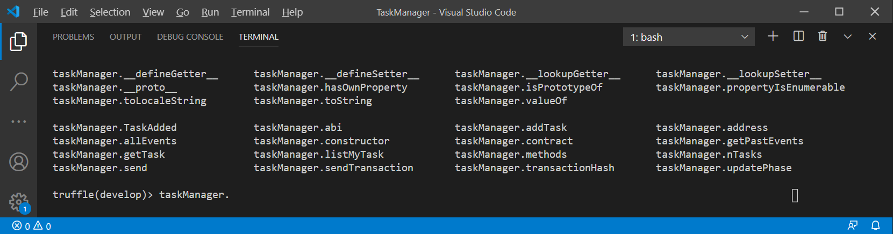

### nTasks

Criamos a variável `nTask` para armazenar o número de tarefas de nosso sistema. Como ela é publica, automaticamente é gerado um "Getter" para consultar seu valor.

```javascript
taskManager.nTasks()
```

```javascript
(await taskManager.nTasks()).toString()
```
O retorno é 3, conforme esperado, dado que na publicação do smart contract já definimos 3 tarefas no construtor, para quem fez o deploy.

Eles estão representados no formato `Big Number`, então faremos uma conversão para string, para facilitar a visualização.

```javascript
(await taskManager.nTasks()).toString()
```

Veja os resultados:

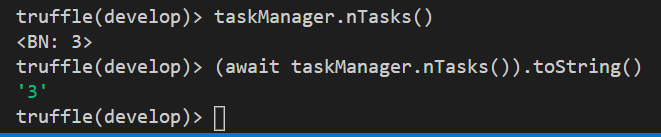

### listMyTasks

Vamos ver uma lista com os índices de todas as nossas tarefas definidas na publicação do smart contract. 

```javascript
taskManager.listMyTasks()
```

O retorno é um array com 3 itens: 0, 1 e 2

Eles estão representados no formato `Big Number`, por isto o `BN`em cada um.

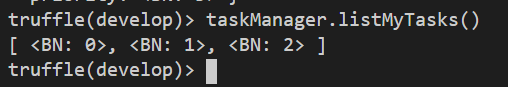

Estas são as 3 tarefas criadas no construtor,para quem fez o deploy do smart contract. Vamos ver os detalhes de cada uma.

### getTask

Vamos consultar a primeira tarefa, que está armazenada no índice 0 to array `tasks`.

```javascript
taskManager.getTask(0)
```

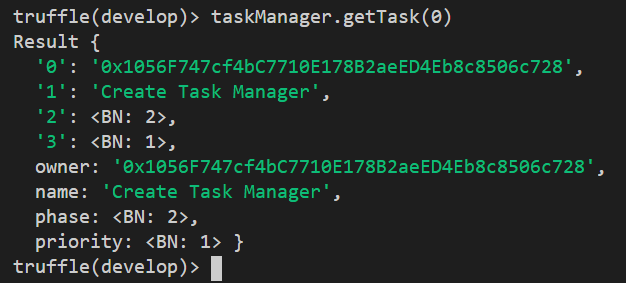

Perceba que o `owner` é a primeira conta, accounts[0].

A fase, que é um `enum`, é representada por seu número correspondente:

<table>
  <tr>
    <td>0</td>
    <td>ToDo</td>
  </tr>
  <tr>
    <td>1</td>
    <td>InProgress</td>
  </tr>
  <tr>
    <td>2</td>
    <td>Done</td>
  </tr>
  <tr>
    <td>3</td>
    <td>Blocked</td>
  </tr>
  <tr>
    <td>4</td>
    <td>Review</td>
  </tr>
  <tr>
    <td>5</td>
    <td>Postponed</td>
  </tr>
  <tr>
    <td>6</td>
    <td>Canceled</td>
  </tr>
</table>
<br/>

Nossa primeira tarefa é `Create Task Manager`, o que já fizemos, ou seja, está na fase 2 (Done).

Podemos fazer a mesma consulta para a tarefa do índice 1

```javascript
taskManager.getTask(1)
```

Task 1: 


E também para a tarefa do índice 2

```javascript
taskManager.getTask(2)
```

Task 2: 

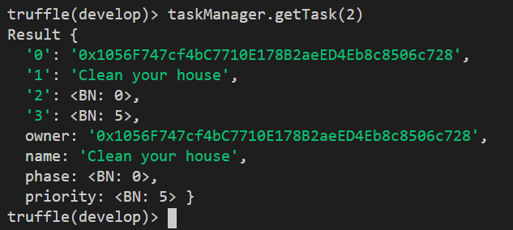

### addTask

Vamos adicionar uma nova tarefa em nossa lista:

* Name: Study Solidity
* Phase: 1 (InProgress)
* Priority: 2

O `owner` desta tarefa será a segunda conta, que no array é accounts[1].

```javascript
tx = await taskManager.addTask ("Study Solidity", 1, 2, {from: accounts[1]})
```

Guardamos na variável `tx` os detalhes da transação enviada e já incluída em um bloco:

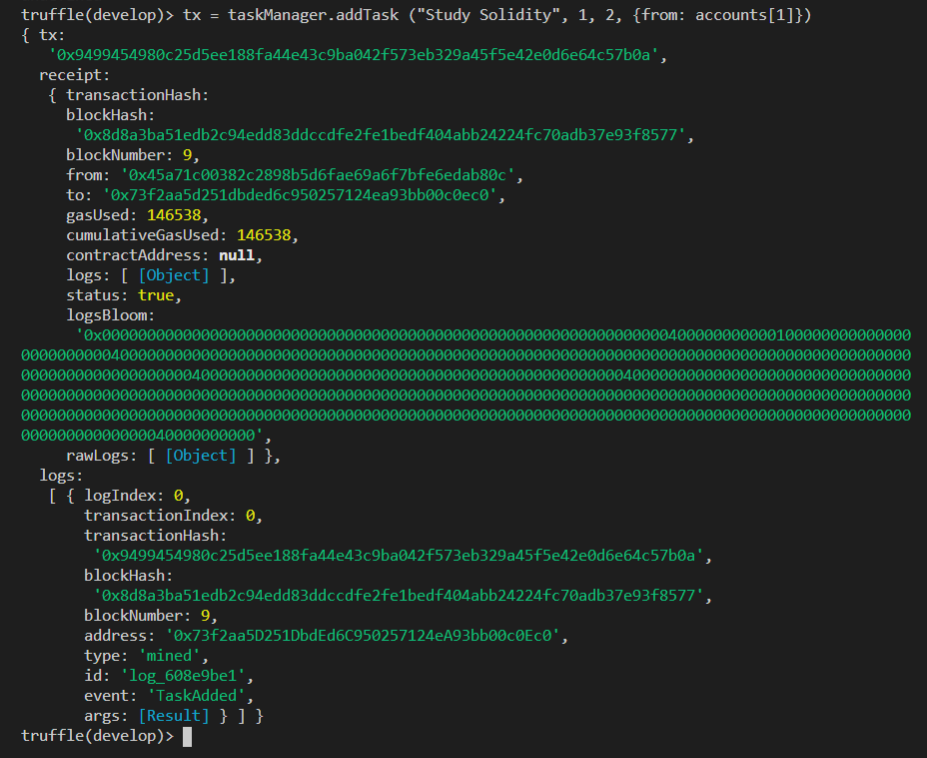

### evento TaskAdded

Na transação tx temos um log, que é o evento `TaskAdded` emitido pela criação da tarefa.

Para ver os detalhes, digite:

```javascript
tx.logs[0]
```

As informações em `Result` são os campos de retorno do evento:

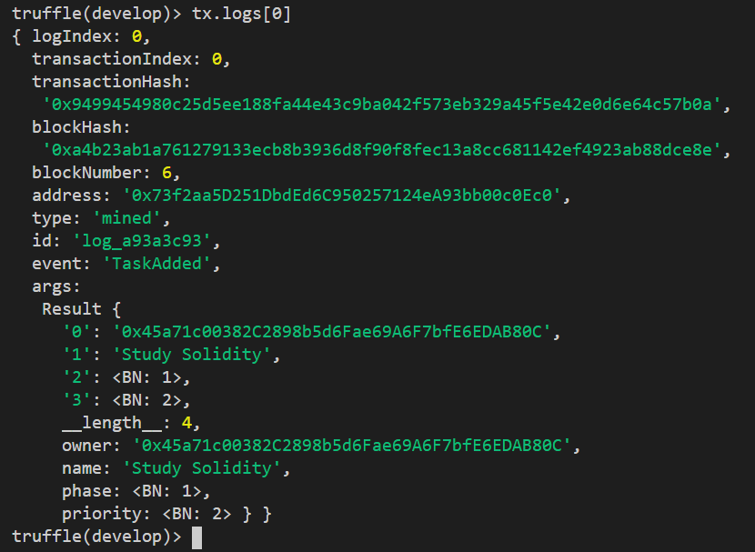

Relembrando a definição do evento:

```javascript
event TaskAdded(address owner, string name, TaskPhase phase, uint priority);
```

### listMyTasks (de novo)

Podemos ver a lista de tarefas da conta accounts[1], fazendo a chamada da função a partir dela:

```javascript
taskManager.listMyTasks({from: accounts[1]})
```

A tarefa que está armazenada no índice 3 to array `tasks` é da conta accounts[1].


### getTask (de novo)

Podemos ver os detalhes da tarefa do índice 3, fazendo a chamada da função a partir da conta accounts[1].

```javascript
taskManager.getTask(3, {from: accounts[1]})
```

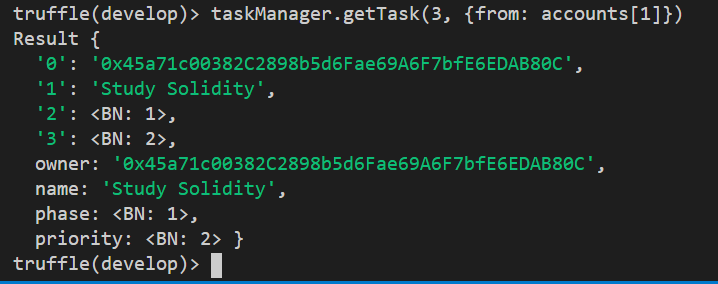

Perceba que o `owner` é a conta accounts[1].

* Name: Study Solidity
* Phase: 1 (InProgress)
* Priority: 2

Ótimo! Exatamente os dados que definimos ao adicionar a tarefa.

### updatePhase

Vamos atualizar a fase de uma tarefa.

Por exemplo, a tarefa do indice 1: `Create Your first task`.

A fase era 0 (ToDo). Vamos atualizá-la para  2 (Done).

```javascript
taskManager.updatePhase(1, 2)
```

O retorno são os detalhes da transação enviada e já incluída em um bloco:

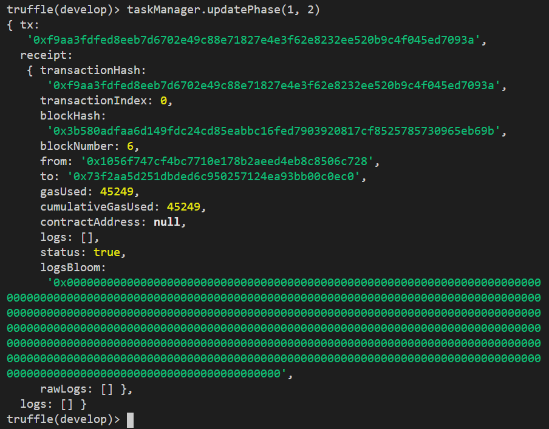

### getTask índice 1

```javascript
taskManager.getTask(1)
```

Veja que a fase foi alterada!

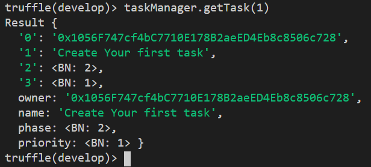

Lembra da tarefa do índice 2? 
Era `Clean your house`. Que tal alterar a fase e adiar a tarefa de limpar a casa? :)

Mude a fase para 5 (Postponed).

# Próximos passos - upgrades

Existem diversas melhorias que podem ser implementadas nos smart contracts do nosso gerenciador de tarefas `TaskManager`.

Aqui estão algumas sugestões:

### Mais informações na estrutura de uma tarefa

Cada tarefa tem uma estrutura com as seguintes informações:

* dono da tarefa, representado pelo seu endereço
* name
* phase
* priority

Que outras informações poderiam ser adicionadas na estrutura?

Algumas sugestões:

* Tipo de tarefa: pessoal, familia, casa, trabalho, escola, etc
* Data limite para execução da tarefa

### Classificação por cores

Você poderia incluir um campo para a cor da tarefa na estrutura, para utilizá-lo quando criar um frontend para o projeto.

### Tarefas por prioridade

Implemente uma função que, dada uma prioridade, retorne a lista de tarefas desta prioridade.

### Tarefas para grupos

Ao invés da tarefa ser exclusiva do owner, poderíamos definir grupos para visualizar ou alterar a tarefa.

# Publicando em Blockchain

O próximo passos é publicar o smart contract em um Blockchain "de verdade",ou seja, uma rede pública ou privada na qual todos tenham acesso.

Minha sugestão é começar experimentando uma Testnet, onde você não terá nenhum custo.

Algumas opções:

* Ehtereum 1.0: Testnet Ropsten ou Testnet Rinkeby
* Azure Blockchain Development Kit
* RSK: Testnet

# Considerações finais

Este workshop é uma iniciativa da [Microsoft Reactor](https://developer.microsoft.com/en-us/reactor/) e o código original encontra-se no [github Reactors](https://github.com/microsoft/Reactors), sob [licença MIT](https://github.com/microsoft/Reactors/blob/main/LICENSE). 

Os Reactors são espaços espalhados pelo mundo onde os profissionais experimentam tecnologias líderes da indústria na Microsoft, parceiros e comunidades de código aberto, enquanto se encontram, aprendem e criam conexões.

